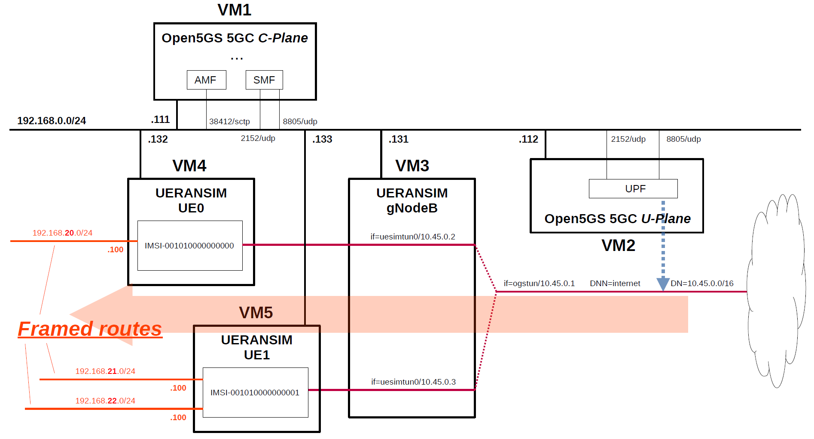

# Open5GS 5GC & UERANSIM UE / RAN Sample Configuration - Framed Routing
This describes a very simple configuration that uses Open5GS and UERANSIM for Framed Routing.

---

<h2 id="conf_list">List of Sample Configurations</h2>

1. [One SGW-C/PGW-C, Multiple SGW-Us/PGW-Us and APNs](https://github.com/s5uishida/open5gs_epc_oai_sample_config)
2. [One SMF, Multiple UPFs and DNNs](https://github.com/s5uishida/open5gs_5gc_ueransim_sample_config)
3. [Select nearby UPF according to the connected gNodeB](https://github.com/s5uishida/open5gs_5gc_ueransim_nearby_upf_sample_config)
4. [Select UPF based on S-NSSAI](https://github.com/s5uishida/open5gs_5gc_ueransim_snssai_upf_sample_config)
5. [SCP Indirect communication Model C](https://github.com/s5uishida/open5gs_5gc_ueransim_scp_model_c_sample_config)
6. [VoLTE and SMS Configuration for docker_open5gs](https://github.com/s5uishida/docker_open5gs_volte_sms_config)
7. [Monitoring Metrics with Prometheus](https://github.com/s5uishida/open5gs_5gc_ueransim_metrics_sample_config)
8. Framed Routing (this article)
---

<h2 id="misc">Miscellaneous Notes</h2>

- [Install MongoDB 6.0 and Open5GS WebUI](https://github.com/s5uishida/open5gs_install_mongodb6_webui)
---

<h2 id="toc">Table of Contents</h2>

- [Overview of Open5GS 5GC Simulation Mobile Network](#overview)
- [Changes in configuration files of Open5GS 5GC and UERANSIM UE / RAN](#changes)
  - [Changes in configuration files of Open5GS 5GC C-Plane](#changes_cp)
  - [Changes in configuration files of Open5GS 5GC U-Plane](#changes_up)
  - [Changes in configuration files of UERANSIM UE / RAN](#changes_ueransim)
    - [Changes in configuration files of RAN](#changes_ran)
    - [Changes in configuration files of UE0 (IMSI-001010000000000)](#changes_ue0)
    - [Changes in configuration files of UE1 (IMSI-001010000000001)](#changes_ue1)
- [Network settings of Open5GS 5GC and UERANSIM UE / RAN](#network_settings)
  - [Network settings of Open5GS 5GC U-Plane](#network_settings_up)
  - [Network settings of UERANSIM UE0](#network_settings_ue0)
  - [Network settings of UERANSIM UE1](#network_settings_ue1)
- [Add Framed Routes to Subscriber information](#add_framed_routes)
  - [Add Framed Routes to UE0](#add_framed_routes_ue0)
  - [Add Framed Routes to UE1](#add_framed_routes_ue1)
- [Build Open5GS and UERANSIM](#build)
- [Run Open5GS 5GC and UERANSIM UE / RAN](#run)
  - [Run Open5GS 5GC C-Plane](#run_cp)
  - [Run Open5GS 5GC U-Plane](#run_up)
  - [Run UERANSIM](#run_ueran)
    - [Start gNodeB](#start_gnb)
    - [Start UE0](#start_ue0)
    - [Start UE1](#start_ue1)
- [Ping Framed Routes](#ping)
  - [Ping IP address (192.168.20.100/24) of Framed Routes of UE0](#ping_ue0)
  - [Ping IP address (192.168.21.100/24) of Framed Routes of UE1](#ping_ue11)
  - [Ping IP address (192.168.22.100/24) of Framed Routes of UE1](#ping_ue12)
  - [Ping IP address (192.168.23.100/24) of Framed Routes (not exist)](#ping_ue2)
- [Changelog (summary)](#changelog)
---
<h2 id="overview">Overview of Open5GS 5GC Simulation Mobile Network</h2>

I created a 5GC simulation mobile network for  the purpose of using  the IP routes (Framed Routes) behind the UE.

The following minimum configuration was set as a condition.
- Two UEs have the same DNN and connect to the same DN.
- Two UEs have different Framed Routes. On the UPF VM, make sure to be able to ping the Framed Routes via the IP address (Tunnel GW/uesimtun0) assigned to each UE.

The built simulation environment is as follows.

</img>

The 5GC / UE / RAN used are as follows.
- 5GC - Open5GS v2.6.0 (2023.01.28) - https://github.com/open5gs/open5gs
- UE / RAN - UERANSIM v3.2.6 - https://github.com/aligungr/UERANSIM

Each VMs are as follows.  
| VM # | SW & Role | IP address | OS | Memory (Min) | HDD (Min) |
| --- | --- | --- | --- | --- | --- |
| VM1 | Open5GS 5GC C-Plane | 192.168.0.111/24 | Ubuntu 20.04 | 1GB | 20GB |
| VM2 | Open5GS 5GC U-Plane  | 192.168.0.112/24 | Ubuntu 20.04 | 1GB | 20GB |
| VM3 | UERANSIM RAN (gNodeB) | 192.168.0.131/24 | Ubuntu 20.04 | 1GB | 10GB |
| VM4 | UERANSIM UE0 | 192.168.0.132/24 | Ubuntu 20.04 | 1GB | 10GB |
| VM5 | UERANSIM UE1 | 192.168.0.133/24 | Ubuntu 20.04 | 1GB | 10GB |

Subscriber Information (other information is the same) is as follows.  
**Note. Please select OP or OPc according to the setting of UERANSIM UE configuration files. As of 2023.01.29, Framed Routes cannot be set with the WebUI. Also, if you change the `open5gs-dbctl` script, it seems that you can register these with this script, but I could not register.**
| UE # | IMSI | DNN | OP/OPc | Framed Routes |
| --- | --- | --- | --- | -- |
| UE0 | 001010000000000 | internet | OPc | 192.168.20.0/24 |
| UE1 | 001010000000001 | internet | OPc | 192.168.21.0/24<br>192.168.22.0/24 |

I registered these information with the Open5GS WebUI.
In addition, [3GPP TS 35.208](https://www.3gpp.org/DynaReport/35208.htm) "4.3 Test Sets" is published by 3GPP as test data for the 3GPP authentication and key generation functions (MILENAGE).

The DN is as follows.
| DN | TUNnel interface of DN | DNN | TUNnel interface of UE |
| --- | --- | --- | --- |
| 10.45.0.0/16 | ogstun | internet | uesimtun0 |

<h2 id="changes">Changes in configuration files of Open5GS 5GC and UERANSIM UE / RAN</h2>

Please refer to the following for building Open5GS and UERANSIM respectively.
- Open5GS v2.6.0 (2023.01.28) - https://open5gs.org/open5gs/docs/guide/02-building-open5gs-from-sources/
- UERANSIM v3.2.6 - https://github.com/aligungr/UERANSIM/wiki/Installation

<h3 id="changes_cp">Changes in configuration files of Open5GS 5GC C-Plane</h3>

- `open5gs/install/etc/open5gs/amf.yaml`
```diff
--- amf.yaml.orig       2023-01-12 20:33:18.000000000 +0900
+++ amf.yaml    2023-01-12 21:17:46.000000000 +0900
@@ -342,26 +342,26 @@
       - addr: 127.0.0.5
         port: 7777
     ngap:
-      - addr: 127.0.0.5
+      - addr: 192.168.0.111
     metrics:
       - addr: 127.0.0.5
         port: 9090
     guami:
       - plmn_id:
-          mcc: 999
-          mnc: 70
+          mcc: 001
+          mnc: 01
         amf_id:
           region: 2
           set: 1
     tai:
       - plmn_id:
-          mcc: 999
-          mnc: 70
+          mcc: 001
+          mnc: 01
         tac: 1
     plmn_support:
       - plmn_id:
-          mcc: 999
-          mnc: 70
+          mcc: 001
+          mnc: 01
         s_nssai:
           - sst: 1
     security:
```
- `open5gs/install/etc/open5gs/smf.yaml`
```diff
--- smf.yaml.orig       2023-01-12 20:33:18.000000000 +0900
+++ smf.yaml    2023-01-29 09:47:21.876573900 +0900
@@ -508,20 +508,17 @@
       - addr: 127.0.0.4
         port: 7777
     pfcp:
-      - addr: 127.0.0.4
-      - addr: ::1
+      - addr: 192.168.0.111
     gtpc:
       - addr: 127.0.0.4
-      - addr: ::1
     gtpu:
-      - addr: 127.0.0.4
-      - addr: ::1
+      - addr: 192.168.0.111
     metrics:
       - addr: 127.0.0.4
         port: 9090
     subnet:
       - addr: 10.45.0.1/16
-      - addr: 2001:db8:cafe::1/48
+        dnn: internet
     dns:
       - 8.8.8.8
       - 8.8.4.4
@@ -695,7 +692,8 @@
 #
 upf:
     pfcp:
-      - addr: 127.0.0.7
+      - addr: 192.168.0.112
+        dnn: internet
 
 #
 # parameter:
```

<h3 id="changes_up">Changes in configuration files of Open5GS 5GC U-Plane</h3>

- `open5gs/install/etc/open5gs/upf.yaml`
```diff
--- upf.yaml.orig       2023-01-12 20:44:34.000000000 +0900
+++ upf.yaml    2023-01-29 09:47:52.262159150 +0900
@@ -173,12 +173,13 @@
 #
 upf:
     pfcp:
-      - addr: 127.0.0.7
+      - addr: 192.168.0.112
     gtpu:
-      - addr: 127.0.0.7
+      - addr: 192.168.0.112
     subnet:
       - addr: 10.45.0.1/16
-      - addr: 2001:db8:cafe::1/48
+        dnn: internet
+        dev: ogstun
     metrics:
       - addr: 127.0.0.7
         port: 9090
```

<h3 id="changes_ueransim">Changes in configuration files of UERANSIM UE / RAN</h3>

<h4 id="changes_ran">Changes in configuration files of RAN</h4>

- `UERANSIM/config/open5gs-gnb.yaml`
```diff
--- open5gs-gnb.yaml.orig       2022-07-03 13:06:44.000000000 +0900
+++ open5gs-gnb.yaml    2023-01-12 21:26:20.000000000 +0900
@@ -1,17 +1,17 @@
-mcc: '999'          # Mobile Country Code value
-mnc: '70'           # Mobile Network Code value (2 or 3 digits)
+mcc: '001'          # Mobile Country Code value
+mnc: '01'           # Mobile Network Code value (2 or 3 digits)
 
 nci: '0x000000010'  # NR Cell Identity (36-bit)
 idLength: 32        # NR gNB ID length in bits [22...32]
 tac: 1              # Tracking Area Code
 
-linkIp: 127.0.0.1   # gNB's local IP address for Radio Link Simulation (Usually same with local IP)
-ngapIp: 127.0.0.1   # gNB's local IP address for N2 Interface (Usually same with local IP)
-gtpIp: 127.0.0.1    # gNB's local IP address for N3 Interface (Usually same with local IP)
+linkIp: 192.168.0.131   # gNB's local IP address for Radio Link Simulation (Usually same with local IP)
+ngapIp: 192.168.0.131   # gNB's local IP address for N2 Interface (Usually same with local IP)
+gtpIp: 192.168.0.131    # gNB's local IP address for N3 Interface (Usually same with local IP)
 
 # List of AMF address information
 amfConfigs:
-  - address: 127.0.0.5
+  - address: 192.168.0.111
     port: 38412
 
 # List of supported S-NSSAIs by this gNB
```

<h4 id="changes_ue0">Changes in configuration files of UE0 (IMSI-001010000000000)</h4>

First, copy `open5gs-ue0.yaml` from `open5gs-ue.yaml`.
```
# cd UERANSIM/config
# cp open5gs-ue.yaml open5gs-ue0.yaml
```
Next, edit `open5gs-ue0.yaml`.
- `UERANSIM/config/open5gs-ue0.yaml`
```diff
--- open5gs-ue.yaml.orig        2022-07-03 13:06:44.000000000 +0900
+++ open5gs-ue0.yaml    2023-01-12 21:28:10.000000000 +0900
@@ -1,9 +1,9 @@
 # IMSI number of the UE. IMSI = [MCC|MNC|MSISDN] (In total 15 digits)
-supi: 'imsi-999700000000001'
+supi: 'imsi-001010000000000'
 # Mobile Country Code value of HPLMN
-mcc: '999'
+mcc: '001'
 # Mobile Network Code value of HPLMN (2 or 3 digits)
-mnc: '70'
+mnc: '01'
 
 # Permanent subscription key
 key: '465B5CE8B199B49FAA5F0A2EE238A6BC'
@@ -20,7 +20,7 @@
 
 # List of gNB IP addresses for Radio Link Simulation
 gnbSearchList:
-  - 127.0.0.1
+  - 192.168.0.131
 
 # UAC Access Identities Configuration
 uacAic:
```

<h4 id="changes_ue1">Changes in configuration files of UE1 (IMSI-001010000000001)</h4>

First, copy `open5gs-ue1.yaml` from `open5gs-ue.yaml`.
```
# cd UERANSIM/config
# cp open5gs-ue.yaml open5gs-ue1.yaml
```
Next, edit `open5gs-ue1.yaml`.
- `UERANSIM/config/open5gs-ue1.yaml`
```diff
--- open5gs-ue.yaml.orig        2022-07-03 13:06:44.000000000 +0900
+++ open5gs-ue1.yaml    2023-01-29 13:36:52.157598766 +0900
@@ -1,9 +1,9 @@
 # IMSI number of the UE. IMSI = [MCC|MNC|MSISDN] (In total 15 digits)
-supi: 'imsi-999700000000001'
+supi: 'imsi-001010000000001'
 # Mobile Country Code value of HPLMN
-mcc: '999'
+mcc: '001'
 # Mobile Network Code value of HPLMN (2 or 3 digits)
-mnc: '70'
+mnc: '01'
 
 # Permanent subscription key
 key: '465B5CE8B199B49FAA5F0A2EE238A6BC'
@@ -20,7 +20,7 @@
 
 # List of gNB IP addresses for Radio Link Simulation
 gnbSearchList:
-  - 127.0.0.1
+  - 192.168.0.131
 
 # UAC Access Identities Configuration
 uacAic:
```

<h2 id="network_settings">Network settings of Open5GS 5GC and UERANSIM UE / RAN</h2>

<h3 id="network_settings_up">Network settings of Open5GS 5GC U-Plane</h3>

First, uncomment the next line in the `/etc/sysctl.conf` file and reflect it in the OS.
```
net.ipv4.ip_forward=1
```
```
# sysctl -p
```
Next, configure the TUNnel interface and NAPT.
```
ip tuntap add name ogstun mode tun
ip addr add 10.45.0.1/16 dev ogstun
ip link set ogstun up

iptables -t nat -A POSTROUTING -s 10.45.0.0/16 ! -o ogstun -j MASQUERADE
```

<h3 id="network_settings_ue0">Network settings of UERANSIM UE0</h3>

After starting UE0 of UERANSIM on VM4, set the Framed Routes IP address (ex.`192.168.20.100/24`) and the routing of DN (`10.45.0.0/16`) to the `uesimtun0` interface as follows.
```
ip addr add 192.168.20.100/24 dev uesimtun0
ip route add 10.45.0.0/16 dev uesimtun0
```

<h3 id="network_settings_ue1">Network settings of UERANSIM UE1</h3>

After starting UE1 of UERANSIM on VM5, set the Framed Routes IP addresses (ex.`192.168.21.100/24` and `192.168.22.100/24`) and the routing of DN (`10.45.0.0/16`) to the `uesimtun0` interface as follows.
```
ip addr add 192.168.21.100/24 dev uesimtun0
ip addr add 192.168.22.100/24 dev uesimtun0
ip route add 10.45.0.0/16 dev uesimtun0
```

<h2 id="add_framed_routes">Add Framed Routes to Subscriber information</h2>

[MongoDB Compass](https://www.mongodb.com/products/compass) is a useful GUI tool for working with MongoDB data.
I used this tool to add Framed Routes in the following operations.

<h3 id="add_framed_routes_ue0">Add Framed Routes to UE0</h3>

The UE0's sample subscriber information registered in MongoDB is as follows in JSON format.
Among these, the items indicated by the arrows are Framed Routes to be added.
```json
{
  "_id": {
    "$oid": "63d51ff360e6c465ca52edbb"
  },
  "schema_version": 1,
  "imsi": "001010000000000",
  "msisdn": [],
  "imeisv": "4370816125816151",
  "mme_host": [],
  "mme_realm": [],
  "purge_flag": [],
  "security": {
    "k": "465B5CE8 B199B49F AA5F0A2E E238A6BC",
    "op": null,
    "opc": "E8ED289D EBA952E4 283B54E8 8E6183CA",
    "amf": "8000",
    "sqn": {
      "$numberLong": "129"
    }
  },
  "ambr": {
    "downlink": {
      "value": 1,
      "unit": 3
    },
    "uplink": {
      "value": 1,
      "unit": 3
    }
  },
  "slice": [
    {
      "sst": 1,
      "default_indicator": true,
      "session": [
        {
          "name": "internet",
          "type": 3,
          "qos": {
            "index": 9,
            "arp": {
              "priority_level": 8,
              "pre_emption_capability": 1,
              "pre_emption_vulnerability": 1
            }
          },
          "ambr": {
            "downlink": {
              "value": 1,
              "unit": 3
            },
            "uplink": {
              "value": 1,
              "unit": 3
            }
          },
          "_id": {
            "$oid": "63d51ff360e6c465ca52edbd"
          },
-->       "ipv4_framed_routes": [
-->         "192.168.20.0/24"
-->       ],
          "pcc_rule": []
        }
      ],
      "_id": {
        "$oid": "63d51ff360e6c465ca52edbc"
      }
    }
  ],
  "access_restriction_data": 32,
  "subscriber_status": 0,
  "network_access_mode": 0,
  "subscribed_rau_tau_timer": 12,
  "__v": 0
}
```

<h3 id="add_framed_routes_ue1">Add Framed Routes to UE1</h3>

The UE1's sample subscriber information registered in MongoDB is as follows in JSON format.
Among these, the items indicated by the arrows are Framed Routes to be added.
```json
{
  "_id": {
    "$oid": "63d53f7360e6c465ca52edcf"
  },
  "schema_version": 1,
  "imsi": "001010000000001",
  "msisdn": [],
  "imeisv": "4370816125816151",
  "mme_host": [],
  "mme_realm": [],
  "purge_flag": [],
  "security": {
    "k": "465B5CE8 B199B49F AA5F0A2E E238A6BC",
    "op": null,
    "opc": "E8ED289D EBA952E4 283B54E8 8E6183CA",
    "amf": "8000",
    "sqn": {
      "$numberLong": "161"
    }
  },
  "ambr": {
    "downlink": {
      "value": 1,
      "unit": 3
    },
    "uplink": {
      "value": 1,
      "unit": 3
    }
  },
  "slice": [
    {
      "sst": 1,
      "default_indicator": true,
      "session": [
        {
          "name": "internet",
          "type": 3,
          "qos": {
            "index": 9,
            "arp": {
              "priority_level": 8,
              "pre_emption_capability": 1,
              "pre_emption_vulnerability": 1
            }
          },
          "ambr": {
            "downlink": {
              "value": 1,
              "unit": 3
            },
            "uplink": {
              "value": 1,
              "unit": 3
            }
          },
          "_id": {
            "$oid": "63d53f7360e6c465ca52edd1"
          },
-->       "ipv4_framed_routes": [
-->         "192.168.21.0/24",
-->         "192.168.22.0/24"
-->       ],
          "pcc_rule": []
        }
      ],
      "_id": {
        "$oid": "63d53f7360e6c465ca52edd0"
      }
    }
  ],
  "access_restriction_data": 32,
  "subscriber_status": 0,
  "network_access_mode": 0,
  "subscribed_rau_tau_timer": 12,
  "__v": 0
}
```

<h2 id="build">Build Open5GS and UERANSIM</h2>

Please refer to the following for building Open5GS and UERANSIM respectively.
- Open5GS v2.6.0 (2023.01.28) - https://open5gs.org/open5gs/docs/guide/02-building-open5gs-from-sources/
- UERANSIM v3.2.6 - https://github.com/aligungr/UERANSIM/wiki/Installation

Install MongoDB on Open5GS 5GC C-Plane machine.
It is not necessary to install MongoDB on Open5GS 5GC U-Plane machine.

<h2 id="run">Run Open5GS 5GC and UERANSIM UE / RAN</h2>

First run the 5GC, then UERANSIM (UE & RAN implementation).

<h3 id="run_cp">Run Open5GS 5GC C-Plane</h3>

First, run Open5GS 5GC C-Plane.

- Open5GS 5GC C-Plane
```
./install/bin/open5gs-nrfd &
sleep 5
./install/bin/open5gs-scpd &
sleep 5
./install/bin/open5gs-smfd &
./install/bin/open5gs-amfd &
./install/bin/open5gs-ausfd &
./install/bin/open5gs-udmd &
./install/bin/open5gs-udrd &
./install/bin/open5gs-pcfd &
./install/bin/open5gs-nssfd &
./install/bin/open5gs-bsfd &
```

<h3 id="run_up">Run Open5GS 5GC U-Plane</h3>

Next, run Open5GS 5GC U-Plane.
```
./install/bin/open5gs-upfd &
```

<h3 id="run_ueran">Run UERANSIM</h3>

First, do an NG Setup between gNodeB and 5GC, then register the UE with 5GC and establish a PDU session.

Please refer to the following for usage of UERANSIM.

https://github.com/aligungr/UERANSIM/wiki/Usage

<h4 id="start_gnb">Start gNodeB</h4>

Start gNodeB as follows.
```
# ./nr-gnb -c ../config/open5gs-gnb.yaml
UERANSIM v3.2.6
[2023-01-29 19:02:58.457] [sctp] [info] Trying to establish SCTP connection... (192.168.0.111:38412)
[2023-01-29 19:02:58.459] [sctp] [info] SCTP connection established (192.168.0.111:38412)
[2023-01-29 19:02:58.459] [sctp] [debug] SCTP association setup ascId[7]
[2023-01-29 19:02:58.460] [ngap] [debug] Sending NG Setup Request
[2023-01-29 19:02:58.460] [ngap] [debug] NG Setup Response received
[2023-01-29 19:02:58.460] [ngap] [info] NG Setup procedure is successful
```
The Open5GS C-Plane log when executed is as follows.
```
01/29 19:02:58.357: [amf] INFO: gNB-N2 accepted[192.168.0.131]:33848 in ng-path module (../src/amf/ngap-sctp.c:113)
01/29 19:02:58.357: [amf] INFO: gNB-N2 accepted[192.168.0.131] in master_sm module (../src/amf/amf-sm.c:676)
01/29 19:02:58.357: [amf] INFO: [Added] Number of gNBs is now 1 (../src/amf/context.c:1034)
01/29 19:02:58.357: [amf] INFO: gNB-N2[192.168.0.131] max_num_of_ostreams : 10 (../src/amf/amf-sm.c:715)
```

<h4 id="start_ue0">Start UE0</h4>

Start UE0 as follows. This will register the UE with 5GC and establish a PDU session.
```
# ./nr-ue -c ../config/open5gs-ue0.yaml
UERANSIM v3.2.6
[2023-01-29 19:05:19.689] [nas] [info] UE switches to state [MM-DEREGISTERED/PLMN-SEARCH]
[2023-01-29 19:05:19.689] [rrc] [debug] New signal detected for cell[1], total [1] cells in coverage
[2023-01-29 19:05:19.690] [nas] [info] Selected plmn[001/01]
[2023-01-29 19:05:19.690] [rrc] [info] Selected cell plmn[001/01] tac[1] category[SUITABLE]
[2023-01-29 19:05:19.690] [nas] [info] UE switches to state [MM-DEREGISTERED/PS]
[2023-01-29 19:05:19.690] [nas] [info] UE switches to state [MM-DEREGISTERED/NORMAL-SERVICE]
[2023-01-29 19:05:19.690] [nas] [debug] Initial registration required due to [MM-DEREG-NORMAL-SERVICE]
[2023-01-29 19:05:19.690] [nas] [debug] UAC access attempt is allowed for identity[0], category[MO_sig]
[2023-01-29 19:05:19.690] [nas] [debug] Sending Initial Registration
[2023-01-29 19:05:19.691] [nas] [info] UE switches to state [MM-REGISTER-INITIATED]
[2023-01-29 19:05:19.691] [rrc] [debug] Sending RRC Setup Request
[2023-01-29 19:05:19.691] [rrc] [info] RRC connection established
[2023-01-29 19:05:19.691] [rrc] [info] UE switches to state [RRC-CONNECTED]
[2023-01-29 19:05:19.692] [nas] [info] UE switches to state [CM-CONNECTED]
[2023-01-29 19:05:19.700] [nas] [debug] Authentication Request received
[2023-01-29 19:05:19.707] [nas] [debug] Security Mode Command received
[2023-01-29 19:05:19.707] [nas] [debug] Selected integrity[2] ciphering[0]
[2023-01-29 19:05:19.725] [nas] [debug] Registration accept received
[2023-01-29 19:05:19.725] [nas] [info] UE switches to state [MM-REGISTERED/NORMAL-SERVICE]
[2023-01-29 19:05:19.725] [nas] [debug] Sending Registration Complete
[2023-01-29 19:05:19.725] [nas] [info] Initial Registration is successful
[2023-01-29 19:05:19.725] [nas] [debug] Sending PDU Session Establishment Request
[2023-01-29 19:05:19.725] [nas] [debug] UAC access attempt is allowed for identity[0], category[MO_sig]
[2023-01-29 19:05:19.930] [nas] [debug] Configuration Update Command received
[2023-01-29 19:05:19.954] [nas] [debug] PDU Session Establishment Accept received
[2023-01-29 19:05:19.957] [nas] [info] PDU Session establishment is successful PSI[1]
[2023-01-29 19:05:19.980] [app] [info] Connection setup for PDU session[1] is successful, TUN interface[uesimtun0, 10.45.0.2] is up.
```
The Open5GS C-Plane log when executed is as follows.
```
01/29 19:05:19.574: [amf] INFO: InitialUEMessage (../src/amf/ngap-handler.c:372)
01/29 19:05:19.574: [amf] INFO: [Added] Number of gNB-UEs is now 1 (../src/amf/context.c:2327)
01/29 19:05:19.574: [amf] INFO:     RAN_UE_NGAP_ID[1] AMF_UE_NGAP_ID[1] TAC[1] CellID[0x10] (../src/amf/ngap-handler.c:533)
01/29 19:05:19.574: [amf] INFO: [suci-0-001-01-0000-0-0-0000000000] Unknown UE by SUCI (../src/amf/context.c:1634)
01/29 19:05:19.574: [amf] INFO: [Added] Number of AMF-UEs is now 1 (../src/amf/context.c:1419)
01/29 19:05:19.574: [gmm] INFO: Registration request (../src/amf/gmm-sm.c:552)
01/29 19:05:19.574: [gmm] INFO: [suci-0-001-01-0000-0-0-0000000000]    SUCI (../src/amf/gmm-handler.c:149)
01/29 19:05:19.575: [sbi] WARNING: [0c621c5c-9fbc-41ed-aaa0-e9add7f343b7] (NF-discover) NF has already been added (../lib/sbi/nnrf-handler.c:739)
01/29 19:05:19.575: [sbi] WARNING: NF EndPoint updated [127.0.0.11:80] (../lib/sbi/context.c:1711)
01/29 19:05:19.575: [sbi] WARNING: NF EndPoint updated [127.0.0.11:7777] (../lib/sbi/context.c:1623)
01/29 19:05:19.575: [sbi] INFO: [0c621c5c-9fbc-41ed-aaa0-e9add7f343b7] (NF-discover) NF Profile updated (../lib/sbi/nnrf-handler.c:762)
01/29 19:05:19.577: [sbi] WARNING: [0c61db2a-9fbc-41ed-bb82-7fbd44cc75b1] (NF-discover) NF has already been added (../lib/sbi/nnrf-handler.c:739)
01/29 19:05:19.577: [sbi] WARNING: NF EndPoint updated [127.0.0.12:80] (../lib/sbi/context.c:1711)
01/29 19:05:19.577: [sbi] WARNING: NF EndPoint updated [127.0.0.12:7777] (../lib/sbi/context.c:1623)
01/29 19:05:19.577: [sbi] WARNING: NF EndPoint updated [127.0.0.12:7777] (../lib/sbi/context.c:1623)
01/29 19:05:19.577: [sbi] WARNING: NF EndPoint updated [127.0.0.12:7777] (../lib/sbi/context.c:1623)
01/29 19:05:19.578: [sbi] INFO: [0c61db2a-9fbc-41ed-bb82-7fbd44cc75b1] (NF-discover) NF Profile updated (../lib/sbi/nnrf-handler.c:762)
01/29 19:05:19.590: [sbi] WARNING: [0c61db2a-9fbc-41ed-bb82-7fbd44cc75b1] (NF-discover) NF has already been added (../lib/sbi/nnrf-handler.c:739)
01/29 19:05:19.591: [sbi] WARNING: NF EndPoint updated [127.0.0.12:80] (../lib/sbi/context.c:1711)
01/29 19:05:19.591: [sbi] WARNING: NF EndPoint updated [127.0.0.12:7777] (../lib/sbi/context.c:1623)
01/29 19:05:19.591: [sbi] WARNING: NF EndPoint updated [127.0.0.12:7777] (../lib/sbi/context.c:1623)
01/29 19:05:19.591: [sbi] WARNING: NF EndPoint updated [127.0.0.12:7777] (../lib/sbi/context.c:1623)
01/29 19:05:19.591: [sbi] INFO: [0c61db2a-9fbc-41ed-bb82-7fbd44cc75b1] (NF-discover) NF Profile updated (../lib/sbi/nnrf-handler.c:762)
01/29 19:05:19.594: [sbi] WARNING: [0c61db2a-9fbc-41ed-bb82-7fbd44cc75b1] (NF-discover) NF has already been added (../lib/sbi/nnrf-handler.c:739)
01/29 19:05:19.594: [sbi] WARNING: NF EndPoint updated [127.0.0.12:80] (../lib/sbi/context.c:1711)
01/29 19:05:19.594: [sbi] WARNING: NF EndPoint updated [127.0.0.12:7777] (../lib/sbi/context.c:1623)
01/29 19:05:19.594: [sbi] WARNING: NF EndPoint updated [127.0.0.12:7777] (../lib/sbi/context.c:1623)
01/29 19:05:19.594: [sbi] WARNING: NF EndPoint updated [127.0.0.12:7777] (../lib/sbi/context.c:1623)
01/29 19:05:19.594: [sbi] INFO: [0c61db2a-9fbc-41ed-bb82-7fbd44cc75b1] (NF-discover) NF Profile updated (../lib/sbi/nnrf-handler.c:762)
01/29 19:05:19.600: [sbi] WARNING: [0c6845e6-9fbc-41ed-8fa9-a9977941d33a] (NF-discover) NF has already been added (../lib/sbi/nnrf-handler.c:739)
01/29 19:05:19.600: [sbi] WARNING: NF EndPoint updated [127.0.0.13:80] (../lib/sbi/context.c:1711)
01/29 19:05:19.600: [sbi] WARNING: NF EndPoint updated [127.0.0.13:7777] (../lib/sbi/context.c:1623)
01/29 19:05:19.600: [sbi] WARNING: NF EndPoint updated [127.0.0.13:7777] (../lib/sbi/context.c:1623)
01/29 19:05:19.600: [sbi] WARNING: NF EndPoint updated [127.0.0.13:7777] (../lib/sbi/context.c:1623)
01/29 19:05:19.601: [sbi] INFO: [0c6845e6-9fbc-41ed-8fa9-a9977941d33a] (NF-discover) NF Profile updated (../lib/sbi/nnrf-handler.c:762)
01/29 19:05:19.603: [sbi] WARNING: [0c67f9c4-9fbc-41ed-8765-5713aaa088ab] (NF-discover) NF has already been added (../lib/sbi/nnrf-handler.c:739)
01/29 19:05:19.603: [sbi] WARNING: NF EndPoint updated [127.0.0.20:80] (../lib/sbi/context.c:1711)
01/29 19:05:19.603: [sbi] WARNING: NF EndPoint updated [127.0.0.20:7777] (../lib/sbi/context.c:1623)
01/29 19:05:19.603: [sbi] INFO: [0c67f9c4-9fbc-41ed-8765-5713aaa088ab] (NF-discover) NF Profile updated (../lib/sbi/nnrf-handler.c:762)
01/29 19:05:19.808: [gmm] INFO: [imsi-001010000000000] Registration complete (../src/amf/gmm-sm.c:1435)
01/29 19:05:19.809: [amf] INFO: [imsi-001010000000000] Configuration update command (../src/amf/nas-path.c:522)
01/29 19:05:19.809: [gmm] INFO:     UTC [2023-01-29T10:05:19] Timezone[0]/DST[0] (../src/amf/gmm-build.c:543)
01/29 19:05:19.810: [gmm] INFO:     LOCAL [2023-01-29T19:05:19] Timezone[32400]/DST[0] (../src/amf/gmm-build.c:548)
01/29 19:05:19.811: [amf] INFO: [Added] Number of AMF-Sessions is now 1 (../src/amf/context.c:2348)
01/29 19:05:19.812: [gmm] INFO: UE SUPI[imsi-001010000000000] DNN[internet] S_NSSAI[SST:1 SD:0xffffff] (../src/amf/gmm-handler.c:1098)
01/29 19:05:19.815: [smf] INFO: [Added] Number of SMF-UEs is now 1 (../src/smf/context.c:1012)
01/29 19:05:19.815: [smf] INFO: [Added] Number of SMF-Sessions is now 1 (../src/smf/context.c:3108)
01/29 19:05:19.817: [sbi] WARNING: [0c61db2a-9fbc-41ed-bb82-7fbd44cc75b1] (NF-discover) NF has already been added (../lib/sbi/nnrf-handler.c:739)
01/29 19:05:19.817: [sbi] WARNING: NF EndPoint updated [127.0.0.12:80] (../lib/sbi/context.c:1711)
01/29 19:05:19.817: [sbi] WARNING: NF EndPoint updated [127.0.0.12:7777] (../lib/sbi/context.c:1623)
01/29 19:05:19.817: [sbi] WARNING: NF EndPoint updated [127.0.0.12:7777] (../lib/sbi/context.c:1623)
01/29 19:05:19.818: [sbi] WARNING: NF EndPoint updated [127.0.0.12:7777] (../lib/sbi/context.c:1623)
01/29 19:05:19.818: [sbi] INFO: [0c61db2a-9fbc-41ed-bb82-7fbd44cc75b1] (NF-discover) NF Profile updated (../lib/sbi/nnrf-handler.c:762)
01/29 19:05:19.823: [sbi] WARNING: [0c6845e6-9fbc-41ed-8fa9-a9977941d33a] (NF-discover) NF has already been added (../lib/sbi/nnrf-handler.c:739)
01/29 19:05:19.823: [sbi] WARNING: NF EndPoint updated [127.0.0.13:80] (../lib/sbi/context.c:1711)
01/29 19:05:19.823: [sbi] WARNING: NF EndPoint updated [127.0.0.13:7777] (../lib/sbi/context.c:1623)
01/29 19:05:19.823: [sbi] WARNING: NF EndPoint updated [127.0.0.13:7777] (../lib/sbi/context.c:1623)
01/29 19:05:19.823: [sbi] WARNING: NF EndPoint updated [127.0.0.13:7777] (../lib/sbi/context.c:1623)
01/29 19:05:19.824: [sbi] INFO: [0c6845e6-9fbc-41ed-8fa9-a9977941d33a] (NF-discover) NF Profile updated (../lib/sbi/nnrf-handler.c:762)
01/29 19:05:19.825: [sbi] WARNING: [0c67f9c4-9fbc-41ed-8765-5713aaa088ab] (NF-discover) NF has already been added (../lib/sbi/nnrf-handler.c:739)
01/29 19:05:19.826: [sbi] WARNING: NF EndPoint updated [127.0.0.20:80] (../lib/sbi/context.c:1711)
01/29 19:05:19.826: [sbi] WARNING: NF EndPoint updated [127.0.0.20:7777] (../lib/sbi/context.c:1623)
01/29 19:05:19.826: [sbi] INFO: [0c67f9c4-9fbc-41ed-8765-5713aaa088ab] (NF-discover) NF Profile updated (../lib/sbi/nnrf-handler.c:762)
01/29 19:05:19.828: [sbi] WARNING: [0c612e5a-9fbc-41ed-b508-fddde7864725] (NF-discover) NF has already been added (../lib/sbi/nnrf-handler.c:739)
01/29 19:05:19.828: [sbi] WARNING: NF EndPoint updated [127.0.0.15:80] (../lib/sbi/context.c:1711)
01/29 19:05:19.828: [sbi] WARNING: NF EndPoint updated [127.0.0.15:7777] (../lib/sbi/context.c:1623)
01/29 19:05:19.828: [sbi] INFO: [0c612e5a-9fbc-41ed-b508-fddde7864725] (NF-discover) NF Profile updated (../lib/sbi/nnrf-handler.c:762)
01/29 19:05:19.830: [smf] INFO: UE SUPI[imsi-001010000000000] DNN[internet] IPv4[10.45.0.2] IPv6[] (../src/smf/npcf-handler.c:527)
01/29 19:05:19.831: [gtp] INFO: gtp_connect() [192.168.0.112]:2152 (../lib/gtp/path.c:60)
```
The Open5GS U-Plane log when executed is as follows.
```
01/29 19:05:19.832: [upf] INFO: [Added] Number of UPF-Sessions is now 1 (../src/upf/context.c:194)
01/29 19:05:19.832: [gtp] INFO: gtp_connect() [192.168.0.111]:2152 (../lib/gtp/path.c:60)
01/29 19:05:19.832: [upf] INFO: UE F-SEID[UP:0x1 CP:0x1] APN[internet] PDN-Type[1] IPv4[10.45.0.2] IPv6[] (../src/upf/context.c:467)
01/29 19:05:19.832: [upf] INFO: UE F-SEID[UP:0x1 CP:0x1] APN[internet] PDN-Type[1] IPv4[10.45.0.2] IPv6[] (../src/upf/context.c:467)
01/29 19:05:19.837: [gtp] INFO: gtp_connect() [192.168.0.131]:2152 (../lib/gtp/path.c:60)
```
Looking at the console log of the `nr-ue` command, UE0 has been assigned the IP address `10.45.0.2` from Open5GS 5GC.
```
[2023-01-29 19:05:19.980] [app] [info] Connection setup for PDU session[1] is successful, TUN interface[uesimtun0, 10.45.0.2] is up.
```
Just in case, make sure it matches the IP address of the UE0's TUNnel interface.
```
# ip addr show
...
12: uesimtun0: <POINTOPOINT,PROMISC,NOTRAILERS,UP,LOWER_UP> mtu 1400 qdisc fq_codel state UNKNOWN group default qlen 500
    link/none 
    inet 10.45.0.2/32 scope global uesimtun0
       valid_lft forever preferred_lft forever
    inet6 fe80::676e:648e:99af:cd6e/64 scope link stable-privacy 
       valid_lft forever preferred_lft forever
...
```
- Run `tcpdump` on VM4 to confirm Framed Routing of UE0
```
# tcpdump -i uesimtun0 -n
tcpdump: verbose output suppressed, use -v or -vv for full protocol decode
listening on uesimtun0, link-type RAW (Raw IP), capture size 262144 bytes
```
**Don't forget [Network settings of UERANSIM UE0](#network_settings_ue0).**

<h4 id="start_ue1">Start UE1</h4>

Start UE1 as follows. This will register the UE with 5GC and establish a PDU session.
```
# ./nr-ue -c ../config/open5gs-ue1.yaml 
UERANSIM v3.2.6
[2023-01-29 19:25:37.965] [nas] [info] UE switches to state [MM-DEREGISTERED/PLMN-SEARCH]
[2023-01-29 19:25:37.966] [rrc] [debug] New signal detected for cell[1], total [1] cells in coverage
[2023-01-29 19:25:38.432] [nas] [info] Selected plmn[001/01]
[2023-01-29 19:25:38.432] [rrc] [info] Selected cell plmn[001/01] tac[1] category[SUITABLE]
[2023-01-29 19:25:38.433] [nas] [info] UE switches to state [MM-DEREGISTERED/PS]
[2023-01-29 19:25:38.433] [nas] [info] UE switches to state [MM-DEREGISTERED/NORMAL-SERVICE]
[2023-01-29 19:25:38.434] [nas] [debug] Initial registration required due to [MM-DEREG-NORMAL-SERVICE]
[2023-01-29 19:25:38.435] [nas] [debug] UAC access attempt is allowed for identity[0], category[MO_sig]
[2023-01-29 19:25:38.435] [nas] [debug] Sending Initial Registration
[2023-01-29 19:25:38.435] [rrc] [debug] Sending RRC Setup Request
[2023-01-29 19:25:38.436] [nas] [info] UE switches to state [MM-REGISTER-INITIATED]
[2023-01-29 19:25:38.437] [rrc] [info] RRC connection established
[2023-01-29 19:25:38.437] [rrc] [info] UE switches to state [RRC-CONNECTED]
[2023-01-29 19:25:38.437] [nas] [info] UE switches to state [CM-CONNECTED]
[2023-01-29 19:25:38.452] [nas] [debug] Authentication Request received
[2023-01-29 19:25:38.456] [nas] [debug] Security Mode Command received
[2023-01-29 19:25:38.456] [nas] [debug] Selected integrity[2] ciphering[0]
[2023-01-29 19:25:38.478] [nas] [debug] Registration accept received
[2023-01-29 19:25:38.479] [nas] [info] UE switches to state [MM-REGISTERED/NORMAL-SERVICE]
[2023-01-29 19:25:38.479] [nas] [debug] Sending Registration Complete
[2023-01-29 19:25:38.479] [nas] [info] Initial Registration is successful
[2023-01-29 19:25:38.479] [nas] [debug] Sending PDU Session Establishment Request
[2023-01-29 19:25:38.479] [nas] [debug] UAC access attempt is allowed for identity[0], category[MO_sig]
[2023-01-29 19:25:38.688] [nas] [debug] Configuration Update Command received
[2023-01-29 19:25:38.709] [nas] [debug] PDU Session Establishment Accept received
[2023-01-29 19:25:38.715] [nas] [info] PDU Session establishment is successful PSI[1]
[2023-01-29 19:25:38.737] [app] [info] Connection setup for PDU session[1] is successful, TUN interface[uesimtun0, 10.45.0.3] is up.
```
The Open5GS C-Plane log when executed is as follows.
```
01/29 19:25:38.434: [amf] INFO: InitialUEMessage (../src/amf/ngap-handler.c:372)
01/29 19:25:38.434: [amf] INFO: [Added] Number of gNB-UEs is now 2 (../src/amf/context.c:2327)
01/29 19:25:38.435: [amf] INFO:     RAN_UE_NGAP_ID[2] AMF_UE_NGAP_ID[2] TAC[1] CellID[0x10] (../src/amf/ngap-handler.c:533)
01/29 19:25:38.435: [amf] INFO: [suci-0-001-01-0000-0-0-0000000001] Unknown UE by SUCI (../src/amf/context.c:1634)
01/29 19:25:38.436: [amf] INFO: [Added] Number of AMF-UEs is now 2 (../src/amf/context.c:1419)
01/29 19:25:38.436: [gmm] INFO: Registration request (../src/amf/gmm-sm.c:552)
01/29 19:25:38.436: [gmm] INFO: [suci-0-001-01-0000-0-0-0000000001]    SUCI (../src/amf/gmm-handler.c:149)
01/29 19:25:38.438: [sbi] WARNING: [0c621c5c-9fbc-41ed-aaa0-e9add7f343b7] (NF-discover) NF has already been added (../lib/sbi/nnrf-handler.c:739)
01/29 19:25:38.439: [sbi] WARNING: NF EndPoint updated [127.0.0.11:80] (../lib/sbi/context.c:1711)
01/29 19:25:38.439: [sbi] WARNING: NF EndPoint updated [127.0.0.11:7777] (../lib/sbi/context.c:1623)
01/29 19:25:38.439: [sbi] INFO: [0c621c5c-9fbc-41ed-aaa0-e9add7f343b7] (NF-discover) NF Profile updated (../lib/sbi/nnrf-handler.c:762)
01/29 19:25:38.442: [sbi] WARNING: [0c61db2a-9fbc-41ed-bb82-7fbd44cc75b1] (NF-discover) NF has already been added (../lib/sbi/nnrf-handler.c:739)
01/29 19:25:38.443: [sbi] WARNING: NF EndPoint updated [127.0.0.12:80] (../lib/sbi/context.c:1711)
01/29 19:25:38.443: [sbi] WARNING: NF EndPoint updated [127.0.0.12:7777] (../lib/sbi/context.c:1623)
01/29 19:25:38.444: [sbi] WARNING: NF EndPoint updated [127.0.0.12:7777] (../lib/sbi/context.c:1623)
01/29 19:25:38.444: [sbi] WARNING: NF EndPoint updated [127.0.0.12:7777] (../lib/sbi/context.c:1623)
01/29 19:25:38.444: [sbi] INFO: [0c61db2a-9fbc-41ed-bb82-7fbd44cc75b1] (NF-discover) NF Profile updated (../lib/sbi/nnrf-handler.c:762)
01/29 19:25:38.454: [sbi] WARNING: [0c61db2a-9fbc-41ed-bb82-7fbd44cc75b1] (NF-discover) NF has already been added (../lib/sbi/nnrf-handler.c:739)
01/29 19:25:38.454: [sbi] WARNING: NF EndPoint updated [127.0.0.12:80] (../lib/sbi/context.c:1711)
01/29 19:25:38.455: [sbi] WARNING: NF EndPoint updated [127.0.0.12:7777] (../lib/sbi/context.c:1623)
01/29 19:25:38.455: [sbi] WARNING: NF EndPoint updated [127.0.0.12:7777] (../lib/sbi/context.c:1623)
01/29 19:25:38.455: [sbi] WARNING: NF EndPoint updated [127.0.0.12:7777] (../lib/sbi/context.c:1623)
01/29 19:25:38.455: [sbi] INFO: [0c61db2a-9fbc-41ed-bb82-7fbd44cc75b1] (NF-discover) NF Profile updated (../lib/sbi/nnrf-handler.c:762)
01/29 19:25:38.459: [sbi] WARNING: [0c61db2a-9fbc-41ed-bb82-7fbd44cc75b1] (NF-discover) NF has already been added (../lib/sbi/nnrf-handler.c:739)
01/29 19:25:38.459: [sbi] WARNING: NF EndPoint updated [127.0.0.12:80] (../lib/sbi/context.c:1711)
01/29 19:25:38.459: [sbi] WARNING: NF EndPoint updated [127.0.0.12:7777] (../lib/sbi/context.c:1623)
01/29 19:25:38.460: [sbi] WARNING: NF EndPoint updated [127.0.0.12:7777] (../lib/sbi/context.c:1623)
01/29 19:25:38.460: [sbi] WARNING: NF EndPoint updated [127.0.0.12:7777] (../lib/sbi/context.c:1623)
01/29 19:25:38.460: [sbi] INFO: [0c61db2a-9fbc-41ed-bb82-7fbd44cc75b1] (NF-discover) NF Profile updated (../lib/sbi/nnrf-handler.c:762)
01/29 19:25:38.468: [sbi] WARNING: [0c6845e6-9fbc-41ed-8fa9-a9977941d33a] (NF-discover) NF has already been added (../lib/sbi/nnrf-handler.c:739)
01/29 19:25:38.469: [sbi] WARNING: NF EndPoint updated [127.0.0.13:80] (../lib/sbi/context.c:1711)
01/29 19:25:38.469: [sbi] WARNING: NF EndPoint updated [127.0.0.13:7777] (../lib/sbi/context.c:1623)
01/29 19:25:38.469: [sbi] WARNING: NF EndPoint updated [127.0.0.13:7777] (../lib/sbi/context.c:1623)
01/29 19:25:38.469: [sbi] WARNING: NF EndPoint updated [127.0.0.13:7777] (../lib/sbi/context.c:1623)
01/29 19:25:38.469: [sbi] INFO: [0c6845e6-9fbc-41ed-8fa9-a9977941d33a] (NF-discover) NF Profile updated (../lib/sbi/nnrf-handler.c:762)
01/29 19:25:38.471: [sbi] WARNING: [0c67f9c4-9fbc-41ed-8765-5713aaa088ab] (NF-discover) NF has already been added (../lib/sbi/nnrf-handler.c:739)
01/29 19:25:38.472: [sbi] WARNING: NF EndPoint updated [127.0.0.20:80] (../lib/sbi/context.c:1711)
01/29 19:25:38.472: [sbi] WARNING: NF EndPoint updated [127.0.0.20:7777] (../lib/sbi/context.c:1623)
01/29 19:25:38.472: [sbi] INFO: [0c67f9c4-9fbc-41ed-8765-5713aaa088ab] (NF-discover) NF Profile updated (../lib/sbi/nnrf-handler.c:762)
01/29 19:25:38.680: [gmm] INFO: [imsi-001010000000001] Registration complete (../src/amf/gmm-sm.c:1435)
01/29 19:25:38.681: [amf] INFO: [imsi-001010000000001] Configuration update command (../src/amf/nas-path.c:522)
01/29 19:25:38.681: [gmm] INFO:     UTC [2023-01-29T10:25:38] Timezone[0]/DST[0] (../src/amf/gmm-build.c:543)
01/29 19:25:38.682: [gmm] INFO:     LOCAL [2023-01-29T19:25:38] Timezone[32400]/DST[0] (../src/amf/gmm-build.c:548)
01/29 19:25:38.683: [amf] INFO: [Added] Number of AMF-Sessions is now 2 (../src/amf/context.c:2348)
01/29 19:25:38.684: [gmm] INFO: UE SUPI[imsi-001010000000001] DNN[internet] S_NSSAI[SST:1 SD:0xffffff] (../src/amf/gmm-handler.c:1098)
01/29 19:25:38.686: [smf] INFO: [Added] Number of SMF-UEs is now 2 (../src/smf/context.c:1012)
01/29 19:25:38.686: [smf] INFO: [Added] Number of SMF-Sessions is now 2 (../src/smf/context.c:3108)
01/29 19:25:38.688: [sbi] WARNING: [0c61db2a-9fbc-41ed-bb82-7fbd44cc75b1] (NF-discover) NF has already been added (../lib/sbi/nnrf-handler.c:739)
01/29 19:25:38.688: [sbi] WARNING: NF EndPoint updated [127.0.0.12:80] (../lib/sbi/context.c:1711)
01/29 19:25:38.688: [sbi] WARNING: NF EndPoint updated [127.0.0.12:7777] (../lib/sbi/context.c:1623)
01/29 19:25:38.688: [sbi] WARNING: NF EndPoint updated [127.0.0.12:7777] (../lib/sbi/context.c:1623)
01/29 19:25:38.689: [sbi] WARNING: NF EndPoint updated [127.0.0.12:7777] (../lib/sbi/context.c:1623)
01/29 19:25:38.689: [sbi] INFO: [0c61db2a-9fbc-41ed-bb82-7fbd44cc75b1] (NF-discover) NF Profile updated (../lib/sbi/nnrf-handler.c:762)
01/29 19:25:38.693: [sbi] WARNING: [0c6845e6-9fbc-41ed-8fa9-a9977941d33a] (NF-discover) NF has already been added (../lib/sbi/nnrf-handler.c:739)
01/29 19:25:38.694: [sbi] WARNING: NF EndPoint updated [127.0.0.13:80] (../lib/sbi/context.c:1711)
01/29 19:25:38.694: [sbi] WARNING: NF EndPoint updated [127.0.0.13:7777] (../lib/sbi/context.c:1623)
01/29 19:25:38.694: [sbi] WARNING: NF EndPoint updated [127.0.0.13:7777] (../lib/sbi/context.c:1623)
01/29 19:25:38.694: [sbi] WARNING: NF EndPoint updated [127.0.0.13:7777] (../lib/sbi/context.c:1623)
01/29 19:25:38.694: [sbi] INFO: [0c6845e6-9fbc-41ed-8fa9-a9977941d33a] (NF-discover) NF Profile updated (../lib/sbi/nnrf-handler.c:762)
01/29 19:25:38.696: [sbi] WARNING: [0c67f9c4-9fbc-41ed-8765-5713aaa088ab] (NF-discover) NF has already been added (../lib/sbi/nnrf-handler.c:739)
01/29 19:25:38.696: [sbi] WARNING: NF EndPoint updated [127.0.0.20:80] (../lib/sbi/context.c:1711)
01/29 19:25:38.696: [sbi] WARNING: NF EndPoint updated [127.0.0.20:7777] (../lib/sbi/context.c:1623)
01/29 19:25:38.697: [sbi] INFO: [0c67f9c4-9fbc-41ed-8765-5713aaa088ab] (NF-discover) NF Profile updated (../lib/sbi/nnrf-handler.c:762)
01/29 19:25:38.698: [sbi] WARNING: [0c612e5a-9fbc-41ed-b508-fddde7864725] (NF-discover) NF has already been added (../lib/sbi/nnrf-handler.c:739)
01/29 19:25:38.698: [sbi] WARNING: NF EndPoint updated [127.0.0.15:80] (../lib/sbi/context.c:1711)
01/29 19:25:38.699: [sbi] WARNING: NF EndPoint updated [127.0.0.15:7777] (../lib/sbi/context.c:1623)
01/29 19:25:38.699: [sbi] INFO: [0c612e5a-9fbc-41ed-b508-fddde7864725] (NF-discover) NF Profile updated (../lib/sbi/nnrf-handler.c:762)
01/29 19:25:38.701: [smf] INFO: UE SUPI[imsi-001010000000001] DNN[internet] IPv4[10.45.0.3] IPv6[] (../src/smf/npcf-handler.c:527)
```
The Open5GS U-Plane log when executed is as follows.
```
01/29 19:25:38.704: [upf] INFO: [Added] Number of UPF-Sessions is now 2 (../src/upf/context.c:194)
01/29 19:25:38.704: [upf] INFO: UE F-SEID[UP:0x2 CP:0x2] APN[internet] PDN-Type[1] IPv4[10.45.0.3] IPv6[] (../src/upf/context.c:467)
01/29 19:25:38.704: [upf] INFO: UE F-SEID[UP:0x2 CP:0x2] APN[internet] PDN-Type[1] IPv4[10.45.0.3] IPv6[] (../src/upf/context.c:467)
```
Looking at the console log of the `nr-ue` command, UE1 has been assigned the IP address `10.45.0.3` from Open5GS 5GC.
```
[2023-01-29 19:25:38.737] [app] [info] Connection setup for PDU session[1] is successful, TUN interface[uesimtun0, 10.45.0.3] is up.
```
Just in case, make sure it matches the IP address of the UE1's TUNnel interface.
```
# ip addr show
...
6: uesimtun0: <POINTOPOINT,PROMISC,NOTRAILERS,UP,LOWER_UP> mtu 1400 qdisc fq_codel state UNKNOWN group default qlen 500
    link/none 
    inet 10.45.0.3/32 scope global uesimtun0
       valid_lft forever preferred_lft forever
    inet6 fe80::68a2:d78b:6f4e:f884/64 scope link stable-privacy 
       valid_lft forever preferred_lft forever
...
```
- Run `tcpdump` on VM5 to confirm Framed Routing of UE1
```
# tcpdump -i uesimtun0 -n
tcpdump: verbose output suppressed, use -v or -vv for full protocol decode
listening on uesimtun0, link-type RAW (Raw IP), capture size 262144 bytes
```
**Don't forget [Network settings of UERANSIM UE1](#network_settings_ue1).**

<h2 id="ping">Ping Framed Routes</h4>

<h3 id="ping_ue0">Ping IP address (192.168.20.100/24) of Framed Routes of UE0</h4>

On UPF (VM2), ping IP address (`192.168.20.100/24`) of Framed Routes of UE0 and confirm with `tcpdump` running on VM4.

```
# ping 192.168.20.100 -I ogstun 
PING 192.168.20.100 (192.168.20.100) from 10.45.0.1 ogstun: 56(84) bytes of data.
64 bytes from 192.168.20.100: icmp_seq=1 ttl=64 time=2.63 ms
64 bytes from 192.168.20.100: icmp_seq=2 ttl=64 time=3.46 ms
64 bytes from 192.168.20.100: icmp_seq=3 ttl=64 time=2.31 ms
```
The `tcpdump` log on UE0 is as follows.
```
20:01:37.269683 IP 10.45.0.1 > 192.168.20.100: ICMP echo request, id 49, seq 1, length 64
20:01:37.269716 IP 192.168.20.100 > 10.45.0.1: ICMP echo reply, id 49, seq 1, length 64
20:01:38.272187 IP 10.45.0.1 > 192.168.20.100: ICMP echo request, id 49, seq 2, length 64
20:01:38.272231 IP 192.168.20.100 > 10.45.0.1: ICMP echo reply, id 49, seq 2, length 64
20:01:39.273160 IP 10.45.0.1 > 192.168.20.100: ICMP echo request, id 49, seq 3, length 64
20:01:39.273199 IP 192.168.20.100 > 10.45.0.1: ICMP echo reply, id 49, seq 3, length 64
```
**Note. Confirm that no packets have arrived at UE1 (VM5).**

<h3 id="ping_ue11">Ping IP address (192.168.21.100/24) of Framed Routes of UE1</h4>

On UPF (VM2), ping IP address (`192.168.21.100/24`) of Framed Routes of UE1 and confirm with `tcpdump` running on VM5.

```
# ping 192.168.21.100 -I ogstun 
PING 192.168.21.100 (192.168.21.100) from 10.45.0.1 ogstun: 56(84) bytes of data.
64 bytes from 192.168.21.100: icmp_seq=1 ttl=64 time=2.71 ms
64 bytes from 192.168.21.100: icmp_seq=2 ttl=64 time=2.92 ms
64 bytes from 192.168.21.100: icmp_seq=3 ttl=64 time=3.42 ms
```
The `tcpdump` log on UE1 is as follows.
```
20:12:39.167367 IP 10.45.0.1 > 192.168.21.100: ICMP echo request, id 50, seq 1, length 64
20:12:39.167488 IP 192.168.21.100 > 10.45.0.1: ICMP echo reply, id 50, seq 1, length 64
20:12:40.168897 IP 10.45.0.1 > 192.168.21.100: ICMP echo request, id 50, seq 2, length 64
20:12:40.168937 IP 192.168.21.100 > 10.45.0.1: ICMP echo reply, id 50, seq 2, length 64
20:12:41.171274 IP 10.45.0.1 > 192.168.21.100: ICMP echo request, id 50, seq 3, length 64
20:12:41.171311 IP 192.168.21.100 > 10.45.0.1: ICMP echo reply, id 50, seq 3, length 64
```
**Note. Confirm that no packets have arrived at UE0 (VM4).**

<h3 id="ping_ue12">Ping IP address (192.168.22.100/24) of Framed Routes of UE1</h4>

On UPF (VM2), ping IP address (`192.168.22.100/24`) of Framed Routes of UE1 and confirm with `tcpdump` running on VM5.

```
# ping 192.168.22.100 -I ogstun 
PING 192.168.22.100 (192.168.22.100) from 10.45.0.1 ogstun: 56(84) bytes of data.
64 bytes from 192.168.22.100: icmp_seq=1 ttl=64 time=2.72 ms
64 bytes from 192.168.22.100: icmp_seq=2 ttl=64 time=3.70 ms
64 bytes from 192.168.22.100: icmp_seq=3 ttl=64 time=3.89 ms
```
The `tcpdump` log on UE1 is as follows.
```
20:16:13.218204 IP 10.45.0.1 > 192.168.22.100: ICMP echo request, id 51, seq 1, length 64
20:16:13.218246 IP 192.168.22.100 > 10.45.0.1: ICMP echo reply, id 51, seq 1, length 64
20:16:14.219303 IP 10.45.0.1 > 192.168.22.100: ICMP echo request, id 51, seq 2, length 64
20:16:14.219337 IP 192.168.22.100 > 10.45.0.1: ICMP echo reply, id 51, seq 2, length 64
20:16:15.220465 IP 10.45.0.1 > 192.168.22.100: ICMP echo request, id 51, seq 3, length 64
20:16:15.220552 IP 192.168.22.100 > 10.45.0.1: ICMP echo reply, id 51, seq 3, length 64
```
**Note. Confirm that no packets have arrived at UE0 (VM4).**

<h3 id="ping_ue2">Ping IP address (192.168.23.100/24) of Framed Routes (not exist)</h4>

On UPF (VM2), ping IP address (`192.168.23.100/24`) of Framed Routes which do not exist on either UE0 or UE1, and confirm no packets with `tcpdump` running on VM4 and VM5.

```
# ping 192.168.23.100 -I ogstun 
PING 192.168.23.100 (192.168.23.100) from 10.45.0.1 ogstun: 56(84) bytes of data.
```
**Make sure there are no tcpdump logs on UE0 and UE1.**

---
I was able to confirm the very simple configuration for Framed Routing.
In practice, I think that PSA-UPF and UE will require more complex network routing configuration.
In this article, I kept the minimum settings necessary to check Framed Routing.
See [here](https://github.com/s5uishida/open5gs_5gc_ueransim_framed_routing_sample_config/issues/2#issuecomment-1464891842) for ping between UE0 and UE1, and ping between Framed routes belonging to different UEs.

I would like to thank the excellent developers and all the contributors of Open5GS and UERANSIM.

<h2 id="changelog">Changelog (summary)</h2>

- [2023.03.11] Added the description about ping between UE0 and UE1, and ping between Framed routes belonging to different UEs.
- [2023.01.29] Initial release.
