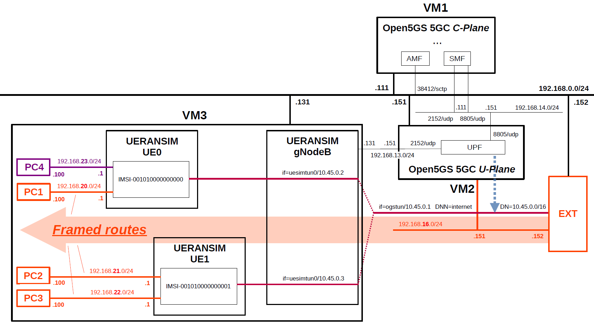
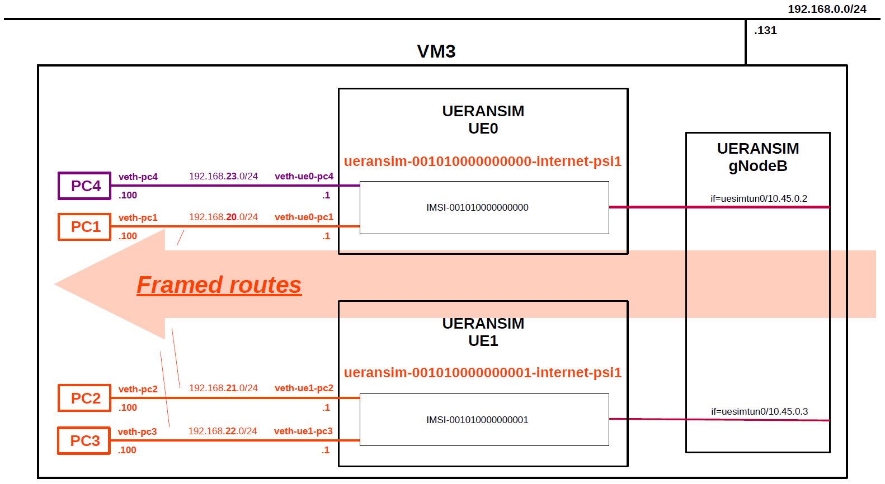

# Open5GS 5GC & UERANSIM UE / RAN Sample Configuration - Framed Routing with Open5GS UPF
This describes a very simple configuration that uses Open5GS and UERANSIM for Framed Routing.

This feature has been merged into Open5GS via the following pull requests by **@mitmitmitm**.

- [Framed routing](https://github.com/open5gs/open5gs/pull/2009)
- [Framed routes udr](https://github.com/open5gs/open5gs/pull/2022)
- [[SMF/PFCP] Send framed routes in both UL and DL pdrs](https://github.com/open5gs/open5gs/pull/2356)

The related documents can be found below.
- https://github.com/gonalobastos/5G-Framed-Routing

---

### [Sample Configurations and Miscellaneous for Mobile Network](https://github.com/s5uishida/sample_config_misc_for_mobile_network)

---

<a id="toc"></a>

## Table of Contents

- [Overview of Open5GS 5GC Simulation Mobile Network](#overview)
- [Changes in configuration files of Open5GS 5GC and UERANSIM UE / RAN](#changes)
  - [Changes in configuration files of Open5GS 5GC C-Plane](#changes_cp)
  - [Changes in configuration files of Open5GS 5GC U-Plane](#changes_up)
  - [Changes in configuration files of UERANSIM UE / RAN](#changes_ueransim)
    - [Changes in configuration files of RAN](#changes_ran)
    - [Changes in configuration files of UE0 (IMSI-001010000000000)](#changes_ue0)
    - [Changes in configuration files of UE1 (IMSI-001010000000001)](#changes_ue1)
- [Network settings of Open5GS 5GC and UERANSIM UE / RAN](#network_settings)
  - [Network settings of Open5GS 5GC U-Plane](#network_settings_up)
  - [Network settings of External Node](#network_settings_ext)
  - [Network settings of VM3](#network_settings_vm3)
    - [Add netns](#add_netns)
    - [Setup veth pair for UE0 and PC1](#setup_ue0)
    - [Setup veth pair for UE1 and PC2/PC3](#setup_ue1)
- [Add Framed Routes to Subscriber information](#add_framed_routes)
  - [Add Framed Routes to UE0](#add_framed_routes_ue0)
  - [Add Framed Routes to UE1](#add_framed_routes_ue1)
- [Build Open5GS and UERANSIM](#build)
- [Run Open5GS 5GC and UERANSIM UE / RAN](#run)
  - [Run Open5GS 5GC C-Plane](#run_cp)
  - [Run Open5GS 5GC U-Plane](#run_up)
  - [Run UERANSIM](#run_ueran)
    - [Start gNodeB](#start_gnb)
    - [Start UE0](#start_ue0)
    - [Start UE1](#start_ue1)
  - [Run tcpdump on PC1](#run_pc1)
  - [Run tcpdump on PC2](#run_pc2)
  - [Run tcpdump on PC3](#run_pc3)
- [Ping Framed Routes](#ping)
  - [Ping IP address (192.168.20.100/24) of Framed Routes of UE0 on PC1](#ping_ue0)
  - [Ping IP address (192.168.21.100/24) of Framed Routes of UE1 on PC2](#ping_ue11)
  - [Ping IP address (192.168.22.100/24) of Framed Routes of UE1 on PC3](#ping_ue12)
  - [Ping IP address (192.168.23.100/24) of Framed Routes (not exist)](#ping_ue2)
- [Changelog (summary)](#changelog)
---
<a id="overview"></a>

## Overview of Open5GS 5GC Simulation Mobile Network

I created a 5GC simulation mobile network for  the purpose of using  the IP routes (Framed Routes) behind the UE.

The following minimum configuration was set as a condition.
- Two UEs have the same DNN and connect to the same DN.
- Two UEs have different Framed Routes. On the UPF VM, make sure to be able to ping the Framed Routes via the IP address (Tunnel GW/uesimtun0) assigned to each UE.

The built simulation environment is as follows.

</img>

The following figure shows the netns and veth pairs within VM3.

</img>

The 5GC / UE / RAN used are as follows.
- 5GC - Open5GS v2.7.7 (2026.04.14) - https://github.com/open5gs/open5gs
- UE / RAN - UERANSIM v3.2.8(+[patch](https://github.com/aligungr/UERANSIM/pull/785)) (2026.04.15) - https://github.com/aligungr/UERANSIM

Each VMs are as follows.  
| VM # | SW & Role | IP address | OS | CPU<br>(Min) | Mem<br>(Min) | HDD<br>(Min) |
| --- | --- | --- | --- | --- | --- | --- |
| VM1 | Open5GS 5GC C-Plane | 192.168.0.111/24<br>192.168.14.111/24 | Ubuntu 24.04 | 1 | 2GB | 20GB |
| VM2 | Open5GS 5GC U-Plane  | 192.168.0.151/24<br>192.168.13.151/24<br>192.168.14.151/24<br>**192.168.16.151/24** | Ubuntu 24.04 | 1 | 1GB | 10GB |
| EXT | External Node | 192.168.0.152/24<br>**192.168.16.152/24** | Ubuntu 24.04 | 1 | 1GB | 10GB |
| VM3 | UERANSIM RAN (gNodeB) | 192.168.0.131/24<br>192.168.13.131/24 | Ubuntu 24.04 | 1 | 1GB | 10GB |
|| UERANSIM UE0 | **192.168.20.1/24** | -- | -- | -- | -- |
|| UERANSIM UE1 | **192.168.21.1/24<br>192.168.22.1/24** | -- | -- | -- | -- |
|| PC1 Internal Node | **192.168.20.100/24** | -- | -- | -- | -- |
|| PC2 Internal Node | **192.168.21.100/24** | -- | -- | -- | -- |
|| PC3 Internal Node | **192.168.22.100/24** | -- | -- | -- | -- |

Pairs of network namespaces and virtual network interfaces are follows.
| Role | netns | veth | veth | netns | Role |
| --- | --- | --- | --- | --- | --- |
| UE0 | ueransim-001010000000000-internet | veth-ue0-pc1 | veth-pc1 | pc1 | PC1 |
| UE1 | ueransim-001010000000001-internet | veth-ue1-pc2 | veth-pc2 | pc2 | PC2 |
| UE1 | ueransim-001010000000001-internet | veth-ue1-pc3 | veth-pc3 | pc3 | PC3 |

Subscriber Information (other information is the same) is as follows.  
**Note. Please select OP or OPc according to the setting of UERANSIM UE configuration files. As of 2023.01.29, Framed Routes cannot be set with the WebUI. Also, if you change the `open5gs-dbctl` script, it seems that you can register these with this script, but I could not register.**
| UE # | IMSI | DNN | OP/OPc | Framed Routes | Internal IP address |
| --- | --- | --- | --- | --- | --- |
| UE0 | 001010000000000 | internet | OPc | **192.168.20.0/24** | **192.168.20.1** |
| UE1 | 001010000000001 | internet | OPc | **192.168.21.0/24<br>192.168.22.0/24** | **192.168.21.1<br>192.168.22.1** |

I registered these information with the Open5GS WebUI.
In addition, [3GPP TS 35.208](https://www.3gpp.org/DynaReport/35208.htm) "4.3 Test Sets" is published by 3GPP as test data for the 3GPP authentication and key generation functions (MILENAGE).

The DN is as follows.
| DN | TUNnel interface of DN | DNN | TUNnel interface of UE |
| --- | --- | --- | --- |
| 10.45.0.0/16 | ogstun | internet | uesimtun0 |

<a id="changes"></a>

## Changes in configuration files of Open5GS 5GC and UERANSIM UE / RAN

Please refer to the following for building Open5GS and UERANSIM respectively.
- Open5GS v2.7.7 (2026.04.14) - https://open5gs.org/open5gs/docs/guide/02-building-open5gs-from-sources/
- UERANSIM v3.2.8(+[patch](https://github.com/aligungr/UERANSIM/pull/785)) (2026.04.15) - https://github.com/aligungr/UERANSIM/wiki/Installation

<a id="changes_cp"></a>

### Changes in configuration files of Open5GS 5GC C-Plane

- `open5gs/install/etc/open5gs/amf.yaml`
```diff
--- amf.yaml.orig       2025-04-27 11:38:05.000000000 +0900
+++ amf.yaml    2025-11-20 07:31:25.166453278 +0900
@@ -20,27 +20,27 @@
         - uri: http://127.0.0.200:7777
   ngap:
     server:
-      - address: 127.0.0.5
+      - address: 192.168.0.111
   metrics:
     server:
       - address: 127.0.0.5
         port: 9090
   guami:
     - plmn_id:
-        mcc: 999
-        mnc: 70
+        mcc: 001
+        mnc: 01
       amf_id:
         region: 2
         set: 1
   tai:
     - plmn_id:
-        mcc: 999
-        mnc: 70
+        mcc: 001
+        mnc: 01
       tac: 1
   plmn_support:
     - plmn_id:
-        mcc: 999
-        mnc: 70
+        mcc: 001
+        mnc: 01
       s_nssai:
         - sst: 1
   security:
```
- `open5gs/install/etc/open5gs/nrf.yaml`
```diff
--- nrf.yaml.orig       2025-04-27 11:38:05.000000000 +0900
+++ nrf.yaml    2025-05-04 08:13:05.973154453 +0900
@@ -11,8 +11,8 @@
 nrf:
   serving:  # 5G roaming requires PLMN in NRF
     - plmn_id:
-        mcc: 999
-        mnc: 70
+        mcc: 001
+        mnc: 01
   sbi:
     server:
       - address: 127.0.0.10
```
- `open5gs/install/etc/open5gs/smf.yaml`
```diff
--- smf.yaml.orig       2025-01-15 04:12:06.000000000 +0900
+++ smf.yaml    2025-01-15 04:26:36.000000000 +0900
@@ -20,16 +20,14 @@
         - uri: http://127.0.0.200:7777
   pfcp:
     server:
-      - address: 127.0.0.4
+      - address: 192.168.14.111
     client:
       upf:
-        - address: 127.0.0.7
-  gtpc:
-    server:
-      - address: 127.0.0.4
+        - address: 192.168.14.151
+          dnn: internet
   gtpu:
     server:
-      - address: 127.0.0.4
+      - address: 192.168.14.111
   metrics:
     server:
       - address: 127.0.0.4
@@ -37,20 +35,17 @@
   session:
     - subnet: 10.45.0.0/16
       gateway: 10.45.0.1
-    - subnet: 2001:db8:cafe::/48
-      gateway: 2001:db8:cafe::1
+      dnn: internet
   dns:
     - 8.8.8.8
     - 8.8.4.4
-    - 2001:4860:4860::8888
-    - 2001:4860:4860::8844
   mtu: 1400
 #  p-cscf:
 #    - 127.0.0.1
 #    - ::1
 #  ctf:
 #    enabled: auto   # auto(default)|yes|no
-  freeDiameter: /root/open5gs/install/etc/freeDiameter/smf.conf
+#  freeDiameter: /root/open5gs/install/etc/freeDiameter/smf.conf
 
 ################################################################################
 # SMF Info
```

<a id="changes_up"></a>

### Changes in configuration files of Open5GS 5GC U-Plane

- `open5gs/install/etc/open5gs/upf.yaml`
```diff
--- upf.yaml.orig       2024-05-02 19:52:00.000000000 +0900
+++ upf.yaml    2024-05-19 12:38:00.000000000 +0900
@@ -11,18 +11,18 @@
 upf:
   pfcp:
     server:
-      - address: 127.0.0.7
+      - address: 192.168.14.151
     client:
 #      smf:     #  UPF PFCP Client try to associate SMF PFCP Server
 #        - address: 127.0.0.4
   gtpu:
     server:
-      - address: 127.0.0.7
+      - address: 192.168.13.151
   session:
     - subnet: 10.45.0.0/16
       gateway: 10.45.0.1
-    - subnet: 2001:db8:cafe::/48
-      gateway: 2001:db8:cafe::1
+      dnn: internet
+      dev: ogstun
   metrics:
     server:
       - address: 127.0.0.7
```

<a id="changes_ueransim"></a>

### Changes in configuration files of UERANSIM UE / RAN

<a id="changes_ran"></a>

#### Changes in configuration files of RAN

- `UERANSIM/config/open5gs-gnb.yaml`
```diff
--- open5gs-gnb.yaml.orig       2024-10-15 20:27:30.453513592 +0900
+++ open5gs-gnb.yaml    2026-04-18 22:24:06.658606032 +0900
@@ -1,17 +1,17 @@
-mcc: '999'          # Mobile Country Code value
-mnc: '70'           # Mobile Network Code value (2 or 3 digits)
+mcc: '001'          # Mobile Country Code value
+mnc: '01'           # Mobile Network Code value (2 or 3 digits)
 
 nci: '0x000000010'  # NR Cell Identity (36-bit)
 idLength: 32        # NR gNB ID length in bits [22...32]
 tac: 1              # Tracking Area Code
 
 linkIp: 127.0.0.1   # gNB's local IP address for Radio Link Simulation (Usually same with local IP)
-ngapIp: 127.0.0.1   # gNB's local IP address for N2 Interface (Usually same with local IP)
-gtpIp: 127.0.0.1    # gNB's local IP address for N3 Interface (Usually same with local IP)
+ngapIp: 192.168.0.131   # gNB's local IP address for N2 Interface (Usually same with local IP)
+gtpIp: 192.168.13.131    # gNB's local IP address for N3 Interface (Usually same with local IP)
 
 # List of AMF address information
 amfConfigs:
-  - address: 127.0.0.5
+  - address: 192.168.0.111
     port: 38412
 
 # List of supported S-NSSAIs by this gNB
```

<a id="changes_ue0"></a>

#### Changes in configuration files of UE0 (IMSI-001010000000000)

First, copy `open5gs-ue0.yaml` from `open5gs-ue.yaml`.
```
# cd UERANSIM/config
# cp open5gs-ue.yaml open5gs-ue0.yaml
```
Next, edit `open5gs-ue0.yaml`.
- `UERANSIM/config/open5gs-ue0.yaml`
```diff
--- open5gs-ue.yaml.orig        2025-03-16 15:49:12.000000000 +0900
+++ open5gs-ue0.yaml    2026-04-18 22:26:12.961649228 +0900
@@ -1,9 +1,9 @@
 # IMSI number of the UE. IMSI = [MCC|MNC|MSISDN] (In total 15 digits)
-supi: 'imsi-999700000000001'
+supi: 'imsi-001010000000000'
 # Mobile Country Code value of HPLMN
-mcc: '999'
+mcc: '001'
 # Mobile Network Code value of HPLMN (2 or 3 digits)
-mnc: '70'
+mnc: '01'
 # SUCI Protection Scheme : 0 for Null-scheme, 1 for Profile A and 2 for Profile B
 protectionScheme: 0
 # Home Network Public Key for protecting with SUCI Profile A
@@ -29,6 +29,12 @@
 # Network mask used for the UE's TUN interface to define the subnet size  
 tunNetmask: '255.255.255.0'
 
+# Create the UE TUN interface inside a dedicated Linux network namespace.
+useNamespace: true
+
+# Optional prefix used when deriving the namespace name.
+nsNamePrefix: 'ueransim'
+
 # List of gNB IP addresses for Radio Link Simulation
 gnbSearchList:
   - 127.0.0.1
```

<a id="changes_ue1"></a>

#### Changes in configuration files of UE1 (IMSI-001010000000001)

First, copy `open5gs-ue1.yaml` from `open5gs-ue.yaml`.
```
# cd UERANSIM/config
# cp open5gs-ue.yaml open5gs-ue1.yaml
```
Next, edit `open5gs-ue1.yaml`.
- `UERANSIM/config/open5gs-ue1.yaml`
```diff
--- open5gs-ue.yaml.orig        2025-03-16 15:49:12.000000000 +0900
+++ open5gs-ue1.yaml    2026-04-18 22:26:38.256058413 +0900
@@ -1,9 +1,9 @@
 # IMSI number of the UE. IMSI = [MCC|MNC|MSISDN] (In total 15 digits)
-supi: 'imsi-999700000000001'
+supi: 'imsi-001010000000001'
 # Mobile Country Code value of HPLMN
-mcc: '999'
+mcc: '001'
 # Mobile Network Code value of HPLMN (2 or 3 digits)
-mnc: '70'
+mnc: '01'
 # SUCI Protection Scheme : 0 for Null-scheme, 1 for Profile A and 2 for Profile B
 protectionScheme: 0
 # Home Network Public Key for protecting with SUCI Profile A
@@ -29,6 +29,12 @@
 # Network mask used for the UE's TUN interface to define the subnet size  
 tunNetmask: '255.255.255.0'
 
+# Create the UE TUN interface inside a dedicated Linux network namespace.
+useNamespace: true
+
+# Optional prefix used when deriving the namespace name.
+nsNamePrefix: 'ueransim'
+
 # List of gNB IP addresses for Radio Link Simulation
 gnbSearchList:
   - 127.0.0.1
```

<a id="network_settings"></a>

## Network settings of Open5GS 5GC and UERANSIM UE / RAN

<a id="network_settings_up"></a>

### Network settings of Open5GS 5GC U-Plane

First, uncomment the next line in the `/etc/sysctl.conf` file and reflect it in the OS.
```
net.ipv4.ip_forward=1
```
```
# sysctl -p
```
Next, configure the TUNnel interface and set the routings towards Framed Routes.
```
ip tuntap add name ogstun mode tun
ip addr add 10.45.0.1/16 dev ogstun
ip link set ogstun up

ip route add 192.168.20.0/24 dev ogstun
ip route add 192.168.21.0/24 dev ogstun
ip route add 192.168.22.0/24 dev ogstun
```

<a id="network_settings_ext"></a>

### Network settings of External Node

Set the routings towards UEs and Framed Routes.
```
ip route add 10.45.0.0/16 via 192.168.16.151
ip route add 192.168.20.0/24 via 192.168.16.151
ip route add 192.168.21.0/24 via 192.168.16.151
ip route add 192.168.22.0/24 via 192.168.16.151
```

<a id="network_settings_vm3"></a>

### Network settings of VM3

Delete default GW.
```
# ip route del default
```

<a id="add_netns"></a>

#### Add netns

First, create 3 netns for the terminals.
```
ip netns add pc1
ip netns add pc2
ip netns add pc3
```
From here on, I will explain how to setup netns and veth, but please note that these settings will be applied to the netns created by running UE0 and UE1.
In other words, run UE0 and UE1 before performing these operations.

<a id="setup_ue0"></a>

#### Setup veth pair for UE0 and PC1

This explanation assumes that running UE0 will create `ueransim-001010000000000-internet` as netns.

First, move to netns:`ueransim-001010000000000-internet`.
```
ip netns exec ueransim-001010000000000-internet bash
```
Enable IP forwarding.
```
sysctl -w net.ipv4.ip_forward=1
```
Create `veth-ue0-pc1` and `veth-pc1`, then move `veth-pc1` to netns:`pc1`. Assign `192.168.20.1/24` to `veth-ue0-pc1` and enable `veth-ue0-pc1`.
```
ip link add veth-ue0-pc1 type veth peer name veth-pc1
ip link set veth-pc1 netns pc1
ip addr add 192.168.20.1/24 dev veth-ue0-pc1
ip link set veth-ue0-pc1 up
```
Next, move to netns:`pc1`.
```
ip netns exec pc1 bash
```
Assign `192.168.20.100/24` ​​to `veth-pc1` and enable `veth-pc1`. Then, set `192.168.20.1` as the default route. Finally, enable interface `lo`.
```
ip addr add 192.168.20.100/24 dev veth-pc1
ip link set veth-pc1 up
ip route add default via 192.168.20.1 dev veth-pc1
ip link set lo up
```

<a id="setup_ue1"></a>

#### Setup veth pair for UE1 and PC2/PC3

This explanation assumes that running UE1 will create `ueransim-001010000000001-internet` as netns.

First, move to netns:`ueransim-001010000000001-internet`.
```
ip netns exec ueransim-001010000000001-internet bash
```
Enable IP forwarding.
```
sysctl -w net.ipv4.ip_forward=1
```
Create `veth-ue1-pc2` and `veth-pc2`, then move `veth-pc2` to netns:`pc2`. Assign `192.168.21.1/24` to `veth-ue1-pc2` and enable `veth-ue1-pc2`.
```
ip link add veth-ue1-pc2 type veth peer name veth-pc2
ip link set veth-pc2 netns pc2
ip addr add 192.168.21.1/24 dev veth-ue1-pc2
ip link set veth-ue1-pc2 up
```
Similarly, create `veth-ue1-pc3` and `veth-pc3`, then move `veth-pc3` to netns:`pc3`. Assign `192.168.22.1/24` to `veth-ue1-pc3` and enable `veth-ue1-pc3`.
```
ip link add veth-ue1-pc3 type veth peer name veth-pc3
ip link set veth-pc3 netns pc3
ip addr add 192.168.22.1/24 dev veth-ue1-pc3
ip link set veth-ue1-pc3 up
```
Next, move to netns:`pc2`.
```
ip netns exec pc2 bash
```
Assign `192.168.21.100/24` ​​to `veth-pc2` and enable `veth-pc2`. Then, set `192.168.21.1` as the default route. Finally, enable interface `lo`.
```
ip addr add 192.168.21.100/24 dev veth-pc2
ip link set veth-pc2 up
ip route add default via 192.168.21.1 dev veth-pc2
ip link set lo up
```
Similarly, move to netns:`pc3`.
```
ip netns exec pc3 bash
```
Assign `192.168.22.100/24` ​​to `veth-pc3` and enable `veth-pc3`. Then, set `192.168.22.1` as the default route. Finally, enable interface `lo`.
```
ip addr add 192.168.22.100/24 dev veth-pc3
ip link set veth-pc3 up
ip route add default via 192.168.22.1 dev veth-pc3
ip link set lo up
```

<a id="add_framed_routes"></a>

## Add Framed Routes to Subscriber information

[MongoDB Compass](https://www.mongodb.com/products/compass) is a useful GUI tool for working with MongoDB data.
I used this tool to add Framed Routes in the following operations.

<a id="add_framed_routes_ue0"></a>

### Add Framed Routes to UE0

The UE0's sample subscriber information registered in MongoDB is as follows in JSON format.
Among these, the items indicated by the arrows are Framed Routes to be added.
```json
{
  "_id": {
    "$oid": "672e210b2a5baf13e3c51a26"
  },
  "ambr": {
    "downlink": {
      "value": 1,
      "unit": 3
    },
    "uplink": {
      "value": 1,
      "unit": 3
    }
  },
  "schema_version": 1,
  "msisdn": [],
  "imeisv": "4370816125816151",
  "mme_host": [],
  "mme_realm": [],
  "purge_flag": [],
  "access_restriction_data": 32,
  "subscriber_status": 0,
  "operator_determined_barring": 0,
  "network_access_mode": 0,
  "subscribed_rau_tau_timer": 12,
  "imsi": "001010000000000",
  "security": {
    "k": "465B5CE8 B199B49F AA5F0A2E E238A6BC",
    "amf": "8000",
    "op": null,
    "opc": "E8ED289D EBA952E4 283B54E8 8E6183CA",
    "sqn": {
      "$numberLong": "1344"
    }
  },
  "slice": [
    {
      "_id": {
        "$oid": "672e210b2a5baf13e3c51a27"
      },
      "sst": 1,
      "default_indicator": true,
      "session": [
        {
          "qos": {
            "arp": {
              "priority_level": 8,
              "pre_emption_capability": 1,
              "pre_emption_vulnerability": 1
            },
            "index": 9
          },
          "ambr": {
            "downlink": {
              "value": 1,
              "unit": 3
            },
            "uplink": {
              "value": 1,
              "unit": 3
            }
          },
          "_id": {
            "$oid": "672e210b2a5baf13e3c51a28"
          },
-->       "ipv4_framed_routes": [
-->         "192.168.20.0/24"
-->       ],
          "name": "internet",
          "type": 1,
          "pcc_rule": []
        }
      ]
    }
  ],
  "__v": 0
}
```

<a id="add_framed_routes_ue1"></a>

### Add Framed Routes to UE1

The UE1's sample subscriber information registered in MongoDB is as follows in JSON format.
Among these, the items indicated by the arrows are Framed Routes to be added.
```json
{
  "_id": {
    "$oid": "691e43a812ac4d03469f1cff"
  },
  "ambr": {
    "downlink": {
      "value": 1,
      "unit": 3
    },
    "uplink": {
      "value": 1,
      "unit": 3
    }
  },
  "schema_version": 1,
  "msisdn": [],
  "imeisv": "4370816125816151",
  "mme_host": [],
  "mme_realm": [],
  "purge_flag": [],
  "access_restriction_data": 32,
  "subscriber_status": 0,
  "operator_determined_barring": 0,
  "network_access_mode": 0,
  "subscribed_rau_tau_timer": 12,
  "imsi": "001010000000001",
  "security": {
    "k": "465B5CE8 B199B49F AA5F0A2E E238A6BC",
    "amf": "8000",
    "op": null,
    "opc": "E8ED289D EBA952E4 283B54E8 8E6183CA",
    "sqn": {
      "$numberLong": "385"
    }
  },
  "slice": [
    {
      "_id": {
        "$oid": "691e43a812ac4d03469f1d00"
      },
      "sst": 1,
      "default_indicator": true,
      "session": [
        {
          "qos": {
            "arp": {
              "priority_level": 8,
              "pre_emption_capability": 1,
              "pre_emption_vulnerability": 1
            },
            "index": 9
          },
          "ambr": {
            "downlink": {
              "value": 1,
              "unit": 3
            },
            "uplink": {
              "value": 1,
              "unit": 3
            }
          },
          "_id": {
            "$oid": "691e43a812ac4d03469f1d01"
          },
-->       "ipv4_framed_routes": [
-->         "192.168.21.0/24",
-->         "192.168.22.0/24"
-->       ],
          "name": "internet",
          "type": 1,
          "pcc_rule": []
        }
      ]
    }
  ],
  "__v": 0
}
```

<a id="build"></a>

## Build Open5GS and UERANSIM

Please refer to the following for building Open5GS and UERANSIM respectively.
- Open5GS v2.7.7 (2026.04.14) - https://open5gs.org/open5gs/docs/guide/02-building-open5gs-from-sources/
- UERANSIM v3.2.8(+[patch](https://github.com/aligungr/UERANSIM/pull/785)) (2026.04.15) - https://github.com/aligungr/UERANSIM/wiki/Installation

Install MongoDB on Open5GS 5GC C-Plane machine.
It is not necessary to install MongoDB on Open5GS 5GC U-Plane machine.

<a id="run"></a>

## Run Open5GS 5GC and UERANSIM UE / RAN

First run the 5GC, then UERANSIM (UE & RAN implementation).

<a id="run_cp"></a>

### Run Open5GS 5GC C-Plane

First, run Open5GS 5GC C-Plane.

- Open5GS 5GC C-Plane
```
./install/bin/open5gs-nrfd &
sleep 2
./install/bin/open5gs-scpd &
sleep 2
./install/bin/open5gs-amfd &
sleep 2
./install/bin/open5gs-smfd &
./install/bin/open5gs-ausfd &
./install/bin/open5gs-udmd &
./install/bin/open5gs-udrd &
./install/bin/open5gs-pcfd &
./install/bin/open5gs-nssfd &
./install/bin/open5gs-bsfd &
```

<a id="run_up"></a>

### Run Open5GS 5GC U-Plane

Next, run Open5GS 5GC U-Plane.
```
./install/bin/open5gs-upfd &
```

<a id="run_ueran"></a>

### Run UERANSIM

First, do an NG Setup between gNodeB and 5GC, then register the UE with 5GC and establish a PDU session.

Please refer to the following for usage of UERANSIM.

https://github.com/aligungr/UERANSIM/wiki/Usage

<a id="start_gnb"></a>

#### Start gNodeB

Start gNodeB as follows.
```
# ./nr-gnb -c ../config/open5gs-gnb.yaml
UERANSIM v3.2.8
[2026-04-26 00:58:27.919] [sctp] [info] Trying to establish SCTP connection... (192.168.0.111:38412)
[2026-04-26 00:58:27.922] [sctp] [info] SCTP connection established (192.168.0.111:38412)
[2026-04-26 00:58:27.923] [sctp] [debug] SCTP association setup ascId[4]
[2026-04-26 00:58:27.923] [ngap] [debug] Sending NG Setup Request
[2026-04-26 00:58:27.929] [ngap] [debug] NG Setup Response received
[2026-04-26 00:58:27.929] [ngap] [info] NG Setup procedure is successful
```
The Open5GS C-Plane log when executed is as follows.
```
04/26 00:58:27.916: [amf] INFO: gNB-N2 accepted[192.168.0.131]:41855 in ng-path module (../src/amf/ngap-sctp.c:113)
04/26 00:58:27.916: [amf] INFO: gNB-N2 accepted[192.168.0.131] in master_sm module (../src/amf/amf-sm.c:953)
04/26 00:58:27.922: [amf] INFO: [Added] Number of gNBs is now 1 (../src/amf/context.c:1277)
04/26 00:58:27.922: [amf] INFO: gNB-N2[192.168.0.131] max_num_of_ostreams : 10 (../src/amf/amf-sm.c:1000)
```

<a id="start_ue0"></a>

#### Start UE0

Start UE0 as follows. This will register the UE with 5GC and establish a PDU session.
```
# ./nr-ue -c ../config/open5gs-ue0.yaml
UERANSIM v3.2.8
[2026-04-26 00:58:39.487] [nas] [info] UE switches to state [MM-DEREGISTERED/PLMN-SEARCH]
[2026-04-26 00:58:39.487] [rrc] [debug] New signal detected for cell[1], total [1] cells in coverage
[2026-04-26 00:58:39.487] [nas] [info] Selected plmn[001/01]
[2026-04-26 00:58:39.487] [rrc] [info] Selected cell plmn[001/01] tac[1] category[SUITABLE]
[2026-04-26 00:58:39.487] [nas] [info] UE switches to state [MM-DEREGISTERED/PS]
[2026-04-26 00:58:39.487] [nas] [info] UE switches to state [MM-DEREGISTERED/NORMAL-SERVICE]
[2026-04-26 00:58:39.487] [nas] [debug] Initial registration required due to [MM-DEREG-NORMAL-SERVICE]
[2026-04-26 00:58:39.488] [nas] [debug] UAC access attempt is allowed for identity[0], category[MO_sig]
[2026-04-26 00:58:39.488] [nas] [debug] Sending Initial Registration
[2026-04-26 00:58:39.489] [rrc] [debug] Sending RRC Setup Request
[2026-04-26 00:58:39.489] [nas] [info] UE switches to state [MM-REGISTER-INITIATED]
[2026-04-26 00:58:39.489] [rrc] [info] RRC connection established
[2026-04-26 00:58:39.489] [rrc] [info] UE switches to state [RRC-CONNECTED]
[2026-04-26 00:58:39.489] [nas] [info] UE switches to state [CM-CONNECTED]
[2026-04-26 00:58:39.495] [nas] [debug] Authentication Request received
[2026-04-26 00:58:39.495] [nas] [debug] Received SQN [000000000FA1]
[2026-04-26 00:58:39.495] [nas] [debug] SQN-MS [000000000000]
[2026-04-26 00:58:39.500] [nas] [debug] Security Mode Command received
[2026-04-26 00:58:39.500] [nas] [debug] Selected integrity[2] ciphering[0]
[2026-04-26 00:58:39.511] [nas] [debug] Registration accept received
[2026-04-26 00:58:39.511] [nas] [info] UE switches to state [MM-REGISTERED/NORMAL-SERVICE]
[2026-04-26 00:58:39.511] [nas] [debug] Sending Registration Complete
[2026-04-26 00:58:39.511] [nas] [info] Initial Registration is successful
[2026-04-26 00:58:39.511] [nas] [debug] Sending PDU Session Establishment Request
[2026-04-26 00:58:39.512] [nas] [debug] UAC access attempt is allowed for identity[0], category[MO_sig]
[2026-04-26 00:58:39.718] [nas] [debug] Configuration Update Command received
[2026-04-26 00:58:39.731] [nas] [debug] PDU Session Establishment Accept received
[2026-04-26 00:58:39.731] [nas] [info] PDU Session establishment is successful PSI[1]
[2026-04-26 00:58:39.784] [app] [info] Connection setup for PDU session[1] is successful, TUN interface[uesimtun0, 10.45.0.2] is up in namespace[ueransim-001010000000000-internet].
```
The Open5GS C-Plane log when executed is as follows.
```
04/26 00:58:39.482: [amf] INFO: InitialUEMessage (../src/amf/ngap-handler.c:461)
04/26 00:58:39.482: [amf] INFO: [Added] Number of gNB-UEs is now 1 (../src/amf/context.c:2777)
04/26 00:58:39.482: [amf] INFO:     RAN_UE_NGAP_ID[1] AMF_UE_NGAP_ID[1] TAC[1] CellID[0x10] (../src/amf/ngap-handler.c:622)
04/26 00:58:39.482: [amf] INFO: [suci-0-001-01-0000-0-0-0000000000] Unknown UE by SUCI (../src/amf/context.c:1912)
04/26 00:58:39.482: [amf] INFO: [Added] Number of AMF-UEs is now 1 (../src/amf/context.c:1688)
04/26 00:58:39.482: [gmm] INFO: Registration request (../src/amf/gmm-sm.c:1670)
04/26 00:58:39.482: [gmm] INFO: [suci-0-001-01-0000-0-0-0000000000]    SUCI (../src/amf/gmm-handler.c:183)
04/26 00:58:39.482: [sbi] INFO: [97537e58-40bf-41f1-ad06-4f7c0fad1c9b] Setup NF Instance [type:AUSF] (../lib/sbi/path.c:307)
04/26 00:58:39.482: [scp] INFO: Setup NF EndPoint(addr) [127.0.0.11:7777] (../src/scp/sbi-path.c:463)
04/26 00:58:39.483: [sbi] INFO: [97525ec4-40bf-41f1-9670-7db42688d55f] Setup NF Instance [type:UDM] (../lib/sbi/path.c:307)
04/26 00:58:39.483: [scp] INFO: Setup NF EndPoint(addr) [127.0.0.12:7777] (../src/scp/sbi-path.c:463)
04/26 00:58:39.484: [sbi] INFO: [975438d4-40bf-41f1-9c3b-4fe7b2e4a7b9] Setup NF Instance [type:UDR] (../lib/sbi/path.c:307)
04/26 00:58:39.484: [scp] INFO: Setup NF EndPoint(addr) [127.0.0.20:7777] (../src/scp/sbi-path.c:463)
04/26 00:58:39.486: [amf] INFO: Setup NF EndPoint(addr) [127.0.0.11:7777] (../src/amf/nausf-handler.c:130)
04/26 00:58:39.488: [scp] INFO: Setup NF EndPoint(addr) [127.0.0.11:7777] (../src/scp/sbi-path.c:463)
04/26 00:58:39.488: [scp] INFO: Setup NF EndPoint(addr) [127.0.0.12:7777] (../src/scp/sbi-path.c:463)
04/26 00:58:39.489: [scp] INFO: Setup NF EndPoint(addr) [127.0.0.20:7777] (../src/scp/sbi-path.c:463)
04/26 00:58:39.491: [ausf] INFO: Setup NF EndPoint(addr) [127.0.0.12:7777] (../src/ausf/nudm-handler.c:337)
04/26 00:58:39.492: [sbi] INFO: [97525ec4-40bf-41f1-9670-7db42688d55f] Setup NF Instance [type:UDM] (../lib/sbi/path.c:307)
04/26 00:58:39.492: [scp] INFO: Setup NF EndPoint(addr) [127.0.0.12:7777] (../src/scp/sbi-path.c:463)
04/26 00:58:39.493: [scp] INFO: Setup NF EndPoint(addr) [127.0.0.20:7777] (../src/scp/sbi-path.c:463)
04/26 00:58:39.494: [sbi] INFO: [97525ec4-40bf-41f1-9670-7db42688d55f] Setup NF Instance [type:UDM] (../lib/sbi/path.c:307)
04/26 00:58:39.494: [scp] INFO: Setup NF EndPoint(addr) [127.0.0.12:7777] (../src/scp/sbi-path.c:463)
04/26 00:58:39.495: [scp] INFO: Setup NF EndPoint(addr) [127.0.0.20:7777] (../src/scp/sbi-path.c:463)
04/26 00:58:39.496: [scp] INFO: Setup NF EndPoint(addr) [127.0.0.12:7777] (../src/scp/sbi-path.c:463)
04/26 00:58:39.496: [scp] INFO: Setup NF EndPoint(addr) [127.0.0.20:7777] (../src/scp/sbi-path.c:463)
04/26 00:58:39.498: [scp] INFO: Setup NF EndPoint(addr) [127.0.0.12:7777] (../src/scp/sbi-path.c:463)
04/26 00:58:39.498: [scp] INFO: Setup NF EndPoint(addr) [127.0.0.12:7777] (../src/scp/sbi-path.c:463)
04/26 00:58:39.499: [amf] INFO: Setup NF EndPoint(addr) [127.0.0.12:7777] (../src/amf/nudm-handler.c:361)
04/26 00:58:39.499: [sbi] INFO: [97547cea-40bf-41f1-ae3c-93be6fe07104] Setup NF Instance [type:PCF] (../lib/sbi/path.c:307)
04/26 00:58:39.499: [scp] INFO: Setup NF EndPoint(addr) [127.0.0.13:7777] (../src/scp/sbi-path.c:463)
04/26 00:58:39.500: [pcf] INFO: Setup NF EndPoint(addr) [127.0.0.5:7777] (../src/pcf/npcf-handler.c:114)
04/26 00:58:39.500: [sbi] INFO: [975438d4-40bf-41f1-9c3b-4fe7b2e4a7b9] Setup NF Instance [type:UDR] (../lib/sbi/path.c:307)
04/26 00:58:39.500: [scp] INFO: Setup NF EndPoint(addr) [127.0.0.20:7777] (../src/scp/sbi-path.c:463)
04/26 00:58:39.502: [amf] INFO: Setup NF EndPoint(addr) [127.0.0.13:7777] (../src/amf/npcf-handler.c:143)
04/26 00:58:39.710: [gmm] INFO: [imsi-001010000000000] Registration complete (../src/amf/gmm-sm.c:3146)
04/26 00:58:39.710: [amf] INFO: [imsi-001010000000000] Configuration update command (../src/amf/nas-path.c:609)
04/26 00:58:39.710: [gmm] INFO:     UTC [2026-04-25T15:58:39] Timezone[0]/DST[0] (../src/amf/gmm-build.c:551)
04/26 00:58:39.710: [gmm] INFO:     LOCAL [2026-04-26T00:58:39] Timezone[32400]/DST[0] (../src/amf/gmm-build.c:556)
04/26 00:58:39.710: [amf] INFO: [Added] Number of AMF-Sessions is now 1 (../src/amf/context.c:2798)
04/26 00:58:39.710: [gmm] INFO: UE SUPI[imsi-001010000000000] DNN[internet] LBO[0] S_NSSAI[SST:1 SD:0xffffff] smContextRef[NULL] smContextResourceURI[NULL] (../src/amf/gmm-handler.c:1419)
04/26 00:58:39.710: [gmm] INFO: V-SMF Instance [9765a0ba-40bf-41f1-89f1-8d0edda910a9](LIST) (../src/amf/gmm-handler.c:1496)
04/26 00:58:39.710: [gmm] INFO: [9765a0ba-40bf-41f1-89f1-8d0edda910a9] Setup NF Instance [type:SMF] (../src/amf/gmm-handler.c:1498)
04/26 00:58:39.710: [gmm] INFO: V-SMF Instance [9765a0ba-40bf-41f1-89f1-8d0edda910a9] (../src/amf/gmm-handler.c:1508)
04/26 00:58:39.710: [gmm] INFO: V-SMF discovered in Non-Roaming or LBO-Roaming[0] (../src/amf/gmm-handler.c:1577)
04/26 00:58:39.710: [gmm] INFO: nsmf_pdusession [1:0x64e3778b1c70:(nil)] (../src/amf/gmm-handler.c:1617)
04/26 00:58:39.710: [scp] INFO: Setup NF EndPoint(addr) [127.0.0.4:7777] (../src/scp/sbi-path.c:463)
04/26 00:58:39.711: [smf] INFO: [Added] Number of SMF-UEs is now 1 (../src/smf/context.c:1069)
04/26 00:58:39.711: [smf] INFO: [Added] Number of SMF-Sessions is now 1 (../src/smf/context.c:3393)
04/26 00:58:39.711: [smf] INFO: Setup NF EndPoint(addr) [127.0.0.5:7777] (../src/smf/nsmf-handler.c:331)
04/26 00:58:39.711: [sbi] INFO: [97525ec4-40bf-41f1-9670-7db42688d55f] Setup NF Instance [type:UDM] (../lib/sbi/path.c:307)
04/26 00:58:39.712: [scp] INFO: Setup NF EndPoint(addr) [127.0.0.12:7777] (../src/scp/sbi-path.c:463)
04/26 00:58:39.712: [scp] INFO: Setup NF EndPoint(addr) [127.0.0.20:7777] (../src/scp/sbi-path.c:463)
04/26 00:58:39.714: [scp] INFO: Setup NF EndPoint(addr) [127.0.0.12:7777] (../src/scp/sbi-path.c:463)
04/26 00:58:39.715: [smf] INFO: Setup NF EndPoint(addr) [127.0.0.12:7777] (../src/smf/nudm-handler.c:456)
04/26 00:58:39.715: [sbi] INFO: [97547cea-40bf-41f1-ae3c-93be6fe07104] Setup NF Instance [type:PCF] (../lib/sbi/path.c:307)
04/26 00:58:39.715: [scp] INFO: Setup NF EndPoint(addr) [127.0.0.13:7777] (../src/scp/sbi-path.c:463)
04/26 00:58:39.715: [amf] INFO: Setup NF EndPoint(addr) [127.0.0.4:7777] (../src/amf/nsmf-handler.c:140)
04/26 00:58:39.716: [pcf] INFO: Setup NF EndPoint(addr) [127.0.0.4:7777] (../src/pcf/npcf-handler.c:448)
04/26 00:58:39.716: [sbi] INFO: [975438d4-40bf-41f1-9c3b-4fe7b2e4a7b9] Setup NF Instance [type:UDR] (../lib/sbi/path.c:307)
04/26 00:58:39.716: [scp] INFO: Setup NF EndPoint(addr) [127.0.0.20:7777] (../src/scp/sbi-path.c:463)
04/26 00:58:39.717: [sbi] INFO: [975270d0-40bf-41f1-b7fd-6db581544e21] Setup NF Instance [type:BSF] (../lib/sbi/path.c:307)
04/26 00:58:39.717: [scp] INFO: Setup NF EndPoint(addr) [127.0.0.15:7777] (../src/scp/sbi-path.c:463)
04/26 00:58:39.718: [pcf] INFO: Setup NF EndPoint(addr) [127.0.0.15:7777] (../src/pcf/nbsf-handler.c:121)
04/26 00:58:39.719: [smf] INFO: Setup NF EndPoint(addr) [127.0.0.13:7777] (../src/smf/npcf-handler.c:373)
04/26 00:58:39.719: [smf] INFO: UE SUPI[imsi-001010000000000] DNN[internet] IPv4[10.45.0.2] IPv6[] (../src/smf/npcf-handler.c:594)
04/26 00:58:39.720: [gtp] INFO: gtp_connect() [192.168.13.151]:2152 (../lib/gtp/path.c:60)
04/26 00:58:39.720: [sbi] INFO: [961b304e-40bf-41f1-bc33-713888538273] Setup NF Instance [type:AMF] (../lib/sbi/path.c:307)
04/26 00:58:39.721: [scp] INFO: Setup NF EndPoint(addr) [127.0.0.5:7777] (../src/scp/sbi-path.c:463)
04/26 00:58:39.723: [scp] INFO: Setup NF EndPoint(addr) [127.0.0.4:7777] (../src/scp/sbi-path.c:463)
04/26 00:58:39.724: [sbi] INFO: [97525ec4-40bf-41f1-9670-7db42688d55f] Setup NF Instance [type:UDM] (../lib/sbi/path.c:307)
04/26 00:58:39.724: [scp] INFO: Setup NF EndPoint(addr) [127.0.0.12:7777] (../src/scp/sbi-path.c:463)
04/26 00:58:39.724: [sbi] INFO: [975438d4-40bf-41f1-9c3b-4fe7b2e4a7b9] Setup NF Instance [type:UDR] (../lib/sbi/path.c:307)
04/26 00:58:39.725: [scp] INFO: Setup NF EndPoint(addr) [127.0.0.20:7777] (../src/scp/sbi-path.c:463)
04/26 00:58:39.726: [amf] INFO: [imsi-001010000000000:1:11][0:0:NULL] /nsmf-pdusession/v1/sm-contexts/{smContextRef}/modify (../src/amf/nsmf-handler.c:954)
```
The Open5GS U-Plane log when executed is as follows.
```
04/26 00:58:39.702: [upf] INFO: [Added] Number of UPF-Sessions is now 1 (../src/upf/context.c:212)
04/26 00:58:39.702: [gtp] INFO: gtp_connect() [192.168.14.111]:2152 (../lib/gtp/path.c:60)
04/26 00:58:39.703: [upf] INFO: UE F-SEID[UP:0xa88 CP:0x9dd] APN[internet] PDN-Type[1] IPv4[10.45.0.2] IPv6[] (../src/upf/context.c:498)
04/26 00:58:39.703: [upf] INFO: UE F-SEID[UP:0xa88 CP:0x9dd] APN[internet] PDN-Type[1] IPv4[10.45.0.2] IPv6[] (../src/upf/context.c:498)
04/26 00:58:39.706: [gtp] INFO: gtp_connect() [192.168.13.131]:2152 (../lib/gtp/path.c:60)
```
Looking at the console log of the `nr-ue` command, UE0 has been assigned the IP address `10.45.0.2` from Open5GS 5GC.
```
[2026-04-26 00:58:39.784] [app] [info] Connection setup for PDU session[1] is successful, TUN interface[uesimtun0, 10.45.0.2] is up in namespace[ueransim-001010000000000-internet].
```
Just in case, move to netns:ueransim-001010000000000-internet and make sure it matches the IP address of the UE0's TUNnel interface.
```
# ip netns exec ueransim-001010000000000-internet bash
# ip addr show
...
5: uesimtun0: <POINTOPOINT,MULTICAST,NOARP,UP,LOWER_UP> mtu 1400 qdisc fq_codel state UNKNOWN group default qlen 500
    link/none 
    inet 10.45.0.2/24 scope global uesimtun0
       valid_lft forever preferred_lft forever
    inet6 fe80::f836:c1e4:ad83:182d/64 scope link stable-privacy 
       valid_lft forever preferred_lft forever
...
```
**Don't forget [Setup veth pair for UE0 and PC1](#setup_ue0).**

<a id="start_ue1"></a>

#### Start UE1

Start UE1 as follows. This will register the UE with 5GC and establish a PDU session.
```
# ./nr-ue -c ../config/open5gs-ue1.yaml 
UERANSIM v3.2.8
[2026-04-26 00:58:58.651] [nas] [info] UE switches to state [MM-DEREGISTERED/PLMN-SEARCH]
[2026-04-26 00:58:58.651] [rrc] [debug] New signal detected for cell[1], total [1] cells in coverage
[2026-04-26 00:58:58.652] [nas] [info] Selected plmn[001/01]
[2026-04-26 00:58:58.652] [rrc] [info] Selected cell plmn[001/01] tac[1] category[SUITABLE]
[2026-04-26 00:58:58.652] [nas] [info] UE switches to state [MM-DEREGISTERED/PS]
[2026-04-26 00:58:58.652] [nas] [info] UE switches to state [MM-DEREGISTERED/NORMAL-SERVICE]
[2026-04-26 00:58:58.652] [nas] [debug] Initial registration required due to [MM-DEREG-NORMAL-SERVICE]
[2026-04-26 00:58:58.652] [nas] [debug] UAC access attempt is allowed for identity[0], category[MO_sig]
[2026-04-26 00:58:58.652] [nas] [debug] Sending Initial Registration
[2026-04-26 00:58:58.652] [rrc] [debug] Sending RRC Setup Request
[2026-04-26 00:58:58.653] [nas] [info] UE switches to state [MM-REGISTER-INITIATED]
[2026-04-26 00:58:58.653] [rrc] [info] RRC connection established
[2026-04-26 00:58:58.653] [rrc] [info] UE switches to state [RRC-CONNECTED]
[2026-04-26 00:58:58.653] [nas] [info] UE switches to state [CM-CONNECTED]
[2026-04-26 00:58:58.657] [nas] [debug] Authentication Request received
[2026-04-26 00:58:58.657] [nas] [debug] Received SQN [000000000581]
[2026-04-26 00:58:58.657] [nas] [debug] SQN-MS [000000000000]
[2026-04-26 00:58:58.661] [nas] [debug] Security Mode Command received
[2026-04-26 00:58:58.661] [nas] [debug] Selected integrity[2] ciphering[0]
[2026-04-26 00:58:58.671] [nas] [debug] Registration accept received
[2026-04-26 00:58:58.671] [nas] [info] UE switches to state [MM-REGISTERED/NORMAL-SERVICE]
[2026-04-26 00:58:58.671] [nas] [debug] Sending Registration Complete
[2026-04-26 00:58:58.672] [nas] [info] Initial Registration is successful
[2026-04-26 00:58:58.672] [nas] [debug] Sending PDU Session Establishment Request
[2026-04-26 00:58:58.673] [nas] [debug] UAC access attempt is allowed for identity[0], category[MO_sig]
[2026-04-26 00:58:58.877] [nas] [debug] Configuration Update Command received
[2026-04-26 00:58:58.889] [nas] [debug] PDU Session Establishment Accept received
[2026-04-26 00:58:58.889] [nas] [info] PDU Session establishment is successful PSI[1]
[2026-04-26 00:58:58.932] [app] [info] Connection setup for PDU session[1] is successful, TUN interface[uesimtun0, 10.45.0.3] is up in namespace[ueransim-001010000000001-internet].
```
The Open5GS C-Plane log when executed is as follows.
```
04/26 00:58:58.647: [amf] INFO: InitialUEMessage (../src/amf/ngap-handler.c:461)
04/26 00:58:58.647: [amf] INFO: [Added] Number of gNB-UEs is now 2 (../src/amf/context.c:2777)
04/26 00:58:58.647: [amf] INFO:     RAN_UE_NGAP_ID[2] AMF_UE_NGAP_ID[2] TAC[1] CellID[0x10] (../src/amf/ngap-handler.c:622)
04/26 00:58:58.647: [amf] INFO: [suci-0-001-01-0000-0-0-0000000001] Unknown UE by SUCI (../src/amf/context.c:1912)
04/26 00:58:58.647: [amf] INFO: [Added] Number of AMF-UEs is now 2 (../src/amf/context.c:1688)
04/26 00:58:58.647: [gmm] INFO: Registration request (../src/amf/gmm-sm.c:1670)
04/26 00:58:58.647: [gmm] INFO: [suci-0-001-01-0000-0-0-0000000001]    SUCI (../src/amf/gmm-handler.c:183)
04/26 00:58:58.647: [sbi] INFO: [97537e58-40bf-41f1-ad06-4f7c0fad1c9b] Setup NF Instance [type:AUSF] (../lib/sbi/path.c:307)
04/26 00:58:58.647: [scp] INFO: Setup NF EndPoint(addr) [127.0.0.11:7777] (../src/scp/sbi-path.c:463)
04/26 00:58:58.647: [sbi] INFO: [97525ec4-40bf-41f1-9670-7db42688d55f] Setup NF Instance [type:UDM] (../lib/sbi/path.c:307)
04/26 00:58:58.648: [scp] INFO: Setup NF EndPoint(addr) [127.0.0.12:7777] (../src/scp/sbi-path.c:463)
04/26 00:58:58.648: [sbi] INFO: [975438d4-40bf-41f1-9c3b-4fe7b2e4a7b9] Setup NF Instance [type:UDR] (../lib/sbi/path.c:307)
04/26 00:58:58.648: [scp] INFO: Setup NF EndPoint(addr) [127.0.0.20:7777] (../src/scp/sbi-path.c:463)
04/26 00:58:58.650: [amf] INFO: Setup NF EndPoint(addr) [127.0.0.11:7777] (../src/amf/nausf-handler.c:130)
04/26 00:58:58.651: [scp] INFO: Setup NF EndPoint(addr) [127.0.0.11:7777] (../src/scp/sbi-path.c:463)
04/26 00:58:58.651: [scp] INFO: Setup NF EndPoint(addr) [127.0.0.12:7777] (../src/scp/sbi-path.c:463)
04/26 00:58:58.652: [scp] INFO: Setup NF EndPoint(addr) [127.0.0.20:7777] (../src/scp/sbi-path.c:463)
04/26 00:58:58.653: [ausf] INFO: Setup NF EndPoint(addr) [127.0.0.12:7777] (../src/ausf/nudm-handler.c:337)
04/26 00:58:58.655: [sbi] INFO: [97525ec4-40bf-41f1-9670-7db42688d55f] Setup NF Instance [type:UDM] (../lib/sbi/path.c:307)
04/26 00:58:58.655: [scp] INFO: Setup NF EndPoint(addr) [127.0.0.12:7777] (../src/scp/sbi-path.c:463)
04/26 00:58:58.655: [scp] INFO: Setup NF EndPoint(addr) [127.0.0.20:7777] (../src/scp/sbi-path.c:463)
04/26 00:58:58.657: [sbi] INFO: [97525ec4-40bf-41f1-9670-7db42688d55f] Setup NF Instance [type:UDM] (../lib/sbi/path.c:307)
04/26 00:58:58.657: [scp] INFO: Setup NF EndPoint(addr) [127.0.0.12:7777] (../src/scp/sbi-path.c:463)
04/26 00:58:58.657: [scp] INFO: Setup NF EndPoint(addr) [127.0.0.20:7777] (../src/scp/sbi-path.c:463)
04/26 00:58:58.658: [scp] INFO: Setup NF EndPoint(addr) [127.0.0.12:7777] (../src/scp/sbi-path.c:463)
04/26 00:58:58.659: [scp] INFO: Setup NF EndPoint(addr) [127.0.0.20:7777] (../src/scp/sbi-path.c:463)
04/26 00:58:58.660: [scp] INFO: Setup NF EndPoint(addr) [127.0.0.12:7777] (../src/scp/sbi-path.c:463)
04/26 00:58:58.661: [scp] INFO: Setup NF EndPoint(addr) [127.0.0.12:7777] (../src/scp/sbi-path.c:463)
04/26 00:58:58.661: [amf] INFO: Setup NF EndPoint(addr) [127.0.0.12:7777] (../src/amf/nudm-handler.c:361)
04/26 00:58:58.661: [sbi] INFO: [97547cea-40bf-41f1-ae3c-93be6fe07104] Setup NF Instance [type:PCF] (../lib/sbi/path.c:307)
04/26 00:58:58.662: [scp] INFO: Setup NF EndPoint(addr) [127.0.0.13:7777] (../src/scp/sbi-path.c:463)
04/26 00:58:58.662: [pcf] INFO: Setup NF EndPoint(addr) [127.0.0.5:7777] (../src/pcf/npcf-handler.c:114)
04/26 00:58:58.662: [sbi] INFO: [975438d4-40bf-41f1-9c3b-4fe7b2e4a7b9] Setup NF Instance [type:UDR] (../lib/sbi/path.c:307)
04/26 00:58:58.662: [scp] INFO: Setup NF EndPoint(addr) [127.0.0.20:7777] (../src/scp/sbi-path.c:463)
04/26 00:58:58.664: [amf] INFO: Setup NF EndPoint(addr) [127.0.0.13:7777] (../src/amf/npcf-handler.c:143)
04/26 00:58:58.870: [gmm] INFO: [imsi-001010000000001] Registration complete (../src/amf/gmm-sm.c:3146)
04/26 00:58:58.870: [amf] INFO: [imsi-001010000000001] Configuration update command (../src/amf/nas-path.c:609)
04/26 00:58:58.870: [gmm] INFO:     UTC [2026-04-25T15:58:58] Timezone[0]/DST[0] (../src/amf/gmm-build.c:551)
04/26 00:58:58.870: [gmm] INFO:     LOCAL [2026-04-26T00:58:58] Timezone[32400]/DST[0] (../src/amf/gmm-build.c:556)
04/26 00:58:58.870: [amf] INFO: [Added] Number of AMF-Sessions is now 2 (../src/amf/context.c:2798)
04/26 00:58:58.870: [gmm] INFO: UE SUPI[imsi-001010000000001] DNN[internet] LBO[0] S_NSSAI[SST:1 SD:0xffffff] smContextRef[NULL] smContextResourceURI[NULL] (../src/amf/gmm-handler.c:1419)
04/26 00:58:58.870: [gmm] INFO: V-SMF Instance [9765a0ba-40bf-41f1-89f1-8d0edda910a9](LIST) (../src/amf/gmm-handler.c:1496)
04/26 00:58:58.870: [gmm] INFO: [9765a0ba-40bf-41f1-89f1-8d0edda910a9] Setup NF Instance [type:SMF] (../src/amf/gmm-handler.c:1498)
04/26 00:58:58.870: [gmm] INFO: V-SMF Instance [9765a0ba-40bf-41f1-89f1-8d0edda910a9] (../src/amf/gmm-handler.c:1508)
04/26 00:58:58.870: [gmm] INFO: V-SMF discovered in Non-Roaming or LBO-Roaming[0] (../src/amf/gmm-handler.c:1577)
04/26 00:58:58.870: [gmm] INFO: nsmf_pdusession [1:0x64e3778b1c70:(nil)] (../src/amf/gmm-handler.c:1617)
04/26 00:58:58.870: [scp] INFO: Setup NF EndPoint(addr) [127.0.0.4:7777] (../src/scp/sbi-path.c:463)
04/26 00:58:58.871: [smf] INFO: [Added] Number of SMF-UEs is now 2 (../src/smf/context.c:1069)
04/26 00:58:58.871: [smf] INFO: [Added] Number of SMF-Sessions is now 2 (../src/smf/context.c:3393)
04/26 00:58:58.871: [smf] INFO: Setup NF EndPoint(addr) [127.0.0.5:7777] (../src/smf/nsmf-handler.c:331)
04/26 00:58:58.871: [sbi] INFO: [97525ec4-40bf-41f1-9670-7db42688d55f] Setup NF Instance [type:UDM] (../lib/sbi/path.c:307)
04/26 00:58:58.871: [scp] INFO: Setup NF EndPoint(addr) [127.0.0.12:7777] (../src/scp/sbi-path.c:463)
04/26 00:58:58.872: [scp] INFO: Setup NF EndPoint(addr) [127.0.0.20:7777] (../src/scp/sbi-path.c:463)
04/26 00:58:58.874: [scp] INFO: Setup NF EndPoint(addr) [127.0.0.12:7777] (../src/scp/sbi-path.c:463)
04/26 00:58:58.874: [smf] INFO: Setup NF EndPoint(addr) [127.0.0.12:7777] (../src/smf/nudm-handler.c:456)
04/26 00:58:58.875: [sbi] INFO: [97547cea-40bf-41f1-ae3c-93be6fe07104] Setup NF Instance [type:PCF] (../lib/sbi/path.c:307)
04/26 00:58:58.875: [scp] INFO: Setup NF EndPoint(addr) [127.0.0.13:7777] (../src/scp/sbi-path.c:463)
04/26 00:58:58.875: [amf] INFO: Setup NF EndPoint(addr) [127.0.0.4:7777] (../src/amf/nsmf-handler.c:140)
04/26 00:58:58.875: [pcf] INFO: Setup NF EndPoint(addr) [127.0.0.4:7777] (../src/pcf/npcf-handler.c:448)
04/26 00:58:58.876: [sbi] INFO: [975438d4-40bf-41f1-9c3b-4fe7b2e4a7b9] Setup NF Instance [type:UDR] (../lib/sbi/path.c:307)
04/26 00:58:58.876: [scp] INFO: Setup NF EndPoint(addr) [127.0.0.20:7777] (../src/scp/sbi-path.c:463)
04/26 00:58:58.877: [sbi] INFO: [975270d0-40bf-41f1-b7fd-6db581544e21] Setup NF Instance [type:BSF] (../lib/sbi/path.c:307)
04/26 00:58:58.877: [scp] INFO: Setup NF EndPoint(addr) [127.0.0.15:7777] (../src/scp/sbi-path.c:463)
04/26 00:58:58.878: [pcf] INFO: Setup NF EndPoint(addr) [127.0.0.15:7777] (../src/pcf/nbsf-handler.c:121)
04/26 00:58:58.879: [smf] INFO: Setup NF EndPoint(addr) [127.0.0.13:7777] (../src/smf/npcf-handler.c:373)
04/26 00:58:58.879: [smf] INFO: UE SUPI[imsi-001010000000001] DNN[internet] IPv4[10.45.0.3] IPv6[] (../src/smf/npcf-handler.c:594)
04/26 00:58:58.880: [sbi] INFO: [961b304e-40bf-41f1-bc33-713888538273] Setup NF Instance [type:AMF] (../lib/sbi/path.c:307)
04/26 00:58:58.880: [scp] INFO: Setup NF EndPoint(addr) [127.0.0.5:7777] (../src/scp/sbi-path.c:463)
04/26 00:58:58.882: [scp] INFO: Setup NF EndPoint(addr) [127.0.0.4:7777] (../src/scp/sbi-path.c:463)
04/26 00:58:58.883: [sbi] INFO: [97525ec4-40bf-41f1-9670-7db42688d55f] Setup NF Instance [type:UDM] (../lib/sbi/path.c:307)
04/26 00:58:58.883: [scp] INFO: Setup NF EndPoint(addr) [127.0.0.12:7777] (../src/scp/sbi-path.c:463)
04/26 00:58:58.884: [sbi] INFO: [975438d4-40bf-41f1-9c3b-4fe7b2e4a7b9] Setup NF Instance [type:UDR] (../lib/sbi/path.c:307)
04/26 00:58:58.884: [scp] INFO: Setup NF EndPoint(addr) [127.0.0.20:7777] (../src/scp/sbi-path.c:463)
04/26 00:58:58.885: [amf] INFO: [imsi-001010000000001:1:11][0:0:NULL] /nsmf-pdusession/v1/sm-contexts/{smContextRef}/modify (../src/amf/nsmf-handler.c:954)
```
The Open5GS U-Plane log when executed is as follows.
```
04/26 00:58:58.862: [upf] INFO: [Added] Number of UPF-Sessions is now 2 (../src/upf/context.c:212)
04/26 00:58:58.862: [upf] INFO: UE F-SEID[UP:0x82b CP:0xc32] APN[internet] PDN-Type[1] IPv4[10.45.0.3] IPv6[] (../src/upf/context.c:498)
04/26 00:58:58.862: [upf] INFO: UE F-SEID[UP:0x82b CP:0xc32] APN[internet] PDN-Type[1] IPv4[10.45.0.3] IPv6[] (../src/upf/context.c:498)
```
Looking at the console log of the `nr-ue` command, UE1 has been assigned the IP address `10.45.0.3` from Open5GS 5GC.
```
[2026-04-26 00:58:58.932] [app] [info] Connection setup for PDU session[1] is successful, TUN interface[uesimtun0, 10.45.0.3] is up in namespace[ueransim-001010000000001-internet].
```
Just in case, move to netns:ueransim-001010000000001-internet and make sure it matches the IP address of the UE1's TUNnel interface.
```
# ip netns exec ueransim-001010000000001-internet bash
# ip addr show
...
6: uesimtun0: <POINTOPOINT,MULTICAST,NOARP,UP,LOWER_UP> mtu 1400 qdisc fq_codel state UNKNOWN group default qlen 500
    link/none 
    inet 10.45.0.3/24 scope global uesimtun0
       valid_lft forever preferred_lft forever
    inet6 fe80::8d80:dbdc:53b0:c48/64 scope link stable-privacy 
       valid_lft forever preferred_lft forever
...
```
**Don't forget [Setup veth pair for UE1 and PC2/PC3](#setup_ue1).**

<a id="run_pc1"></a>

### Run tcpdump on PC1

On PC1, run `tcpdump` on `veth-pc1` to check Frame Routing of UE0 (`192.168.20.0/24`).
```
# ip netns exec pc1 bash
# tcpdump -l -i veth-pc1 -n
tcpdump: verbose output suppressed, use -v[v]... for full protocol decode
listening on veth-pc1, link-type EN10MB (Ethernet), snapshot length 262144 bytes
```

<a id="run_pc2"></a>

### Run tcpdump on PC2

On PC2, run `tcpdump` on `veth-pc2` to check Frame Routing of UE1 (`192.168.21.0/24`).
```
# ip netns exec pc2 bash
# tcpdump -l -i veth-pc2 -n
tcpdump: verbose output suppressed, use -v[v]... for full protocol decode
listening on veth-pc2, link-type EN10MB (Ethernet), snapshot length 262144 bytes
```

<a id="run_pc3"></a>

### Run tcpdump on PC3

On PC3, run `tcpdump` on `veth-pc3` to check Frame Routing of UE1 (`192.168.22.0/24`).
```
# ip netns exec pc3 bash
# tcpdump -l -i veth-pc3 -n
tcpdump: verbose output suppressed, use -v[v]... for full protocol decode
listening on veth-pc3, link-type EN10MB (Ethernet), snapshot length 262144 bytes
```

<a id="ping"></a>

## Ping Framed Routes

<a id="ping_ue0"></a>

### Ping IP address (192.168.20.100/24) of Framed Routes of UE0 on PC1

On EXT (External Node), ping IP address (`192.168.20.100/24`) of Framed Routes of UE0 and confirm with `tcpdump` running on PC1.
```
# ping 192.168.20.100
PING 192.168.20.100 (192.168.20.100) 56(84) bytes of data.
64 bytes from 192.168.20.100: icmp_seq=1 ttl=62 time=0.912 ms
64 bytes from 192.168.20.100: icmp_seq=2 ttl=62 time=0.816 ms
64 bytes from 192.168.20.100: icmp_seq=3 ttl=62 time=0.840 ms
```
The `tcpdump` log on PC1 is as follows.
```
01:19:03.983340 IP 192.168.16.152 > 192.168.20.100: ICMP echo request, id 2147, seq 1, length 64
01:19:03.983350 IP 192.168.20.100 > 192.168.16.152: ICMP echo reply, id 2147, seq 1, length 64
01:19:05.012264 IP 192.168.16.152 > 192.168.20.100: ICMP echo request, id 2147, seq 2, length 64
01:19:05.012274 IP 192.168.20.100 > 192.168.16.152: ICMP echo reply, id 2147, seq 2, length 64
01:19:06.036381 IP 192.168.16.152 > 192.168.20.100: ICMP echo request, id 2147, seq 3, length 64
01:19:06.036392 IP 192.168.20.100 > 192.168.16.152: ICMP echo reply, id 2147, seq 3, length 64
```
**Note. Confirm that no packets have arrived at PC2 and PC3.**

<a id="ping_ue11"></a>

### Ping IP address (192.168.21.100/24) of Framed Routes of UE1 on PC2

On EXT (External Node), ping IP address (`192.168.21.100/24`) of Framed Routes of UE1 and confirm with `tcpdump` running on PC2.
```
# ping 192.168.21.100
PING 192.168.21.100 (192.168.21.100) 56(84) bytes of data.
64 bytes from 192.168.21.100: icmp_seq=1 ttl=62 time=0.982 ms
64 bytes from 192.168.21.100: icmp_seq=2 ttl=62 time=0.847 ms
64 bytes from 192.168.21.100: icmp_seq=3 ttl=62 time=0.949 ms
```
The `tcpdump` log on PC2 is as follows.
```
01:20:13.415048 IP 192.168.16.152 > 192.168.21.100: ICMP echo request, id 2149, seq 1, length 64
01:20:13.415057 IP 192.168.21.100 > 192.168.16.152: ICMP echo reply, id 2149, seq 1, length 64
01:20:14.416216 IP 192.168.16.152 > 192.168.21.100: ICMP echo request, id 2149, seq 2, length 64
01:20:14.416226 IP 192.168.21.100 > 192.168.16.152: ICMP echo reply, id 2149, seq 2, length 64
01:20:15.419250 IP 192.168.16.152 > 192.168.21.100: ICMP echo request, id 2149, seq 3, length 64
01:20:15.419261 IP 192.168.21.100 > 192.168.16.152: ICMP echo reply, id 2149, seq 3, length 64
```
**Note. Confirm that no packets have arrived at PC1 and PC3.**

<a id="ping_ue12"></a>

### Ping IP address (192.168.22.100/24) of Framed Routes of UE1 on PC3

On EXT (External Node), ping IP address (`192.168.22.100/24`) of Framed Routes of UE1 and confirm with `tcpdump` running on PC3.
```
# ping 192.168.22.100
PING 192.168.22.100 (192.168.22.100) 56(84) bytes of data.
64 bytes from 192.168.22.100: icmp_seq=1 ttl=62 time=0.950 ms
64 bytes from 192.168.22.100: icmp_seq=2 ttl=62 time=0.880 ms
64 bytes from 192.168.22.100: icmp_seq=3 ttl=62 time=0.880 ms
```
The `tcpdump` log on PC3 is as follows.
```
01:20:56.595509 IP 192.168.16.152 > 192.168.22.100: ICMP echo request, id 2153, seq 1, length 64
01:20:56.595517 IP 192.168.22.100 > 192.168.16.152: ICMP echo reply, id 2153, seq 1, length 64
01:20:57.596682 IP 192.168.16.152 > 192.168.22.100: ICMP echo request, id 2153, seq 2, length 64
01:20:57.596693 IP 192.168.22.100 > 192.168.16.152: ICMP echo reply, id 2153, seq 2, length 64
01:20:58.623403 IP 192.168.16.152 > 192.168.22.100: ICMP echo request, id 2153, seq 3, length 64
01:20:58.623413 IP 192.168.22.100 > 192.168.16.152: ICMP echo reply, id 2153, seq 3, length 64
```
**Note. Confirm that no packets have arrived at PC1 and PC2.**

<a id="ping_ue2"></a>

### Ping IP address (192.168.23.100/24) of Framed Routes (not exist)

On EXT (External Node), ping IP address (`192.168.23.100/24`) of Framed Routes which do not exist on either UE0 or UE1, and confirm no packets with `tcpdump` running on PC1, PC2 and PC3.
```
# ping 192.168.23.100
PING 192.168.23.100 (192.168.23.100) 56(84) bytes of data.
```
**Make sure there are no tcpdump logs on PC1, PC2 and PC3.**

---
I was able to confirm the very simple configuration for Framed Routing.
In practice, I think that PSA-UPF and UE will require more complex network routing configuration.
In this article, I kept the minimum settings necessary to check Framed Routing.
Also in this scenario, UE0 and UE1 only serve routing and not NAT. You may run `ping` and `iperf3` commands bidirectionally between PC1, PC2, PC3 and EXT.

I would like to thank the excellent developers and all the contributors of Open5GS and UERANSIM.

<a id="changelog"></a>

## Changelog (summary)

- [2026.04.25] Changed to the method that uses network namespaces for UERANSIM gNodeB and UE.
- [2026.02.11] Changed to the scenario where N3/N4/N6 interfaces of UPF are separated into different networks.
- [2025.11.22] Added information related to Open5GS Framed Routing feature to the top of this article.
- [2025.11.21] Modified the scenario to verify Framed Routing to explain it in a bit more detail.
- [2024.03.31] [This commit](https://github.com/open5gs/open5gs/commit/e8a3b76af395a9986234b7d339a7a96dc5bb537f) fixed the issue where SMF crashes without `gtpc` section in `smf.yaml`. So deleted the `gtpc` section in `smf.yaml` for 5G use.
- [2024.03.29] Updated to Open5GS v2.7.0 (2024.03.24).
- [2023.03.18] Updated to Open5GS v2.6.1 (2023.03.18) and UERANSIM v3.2.6 (2023.03.17).
- [2023.03.11] Added the description about ping between UE0 and UE1, and ping between Framed routes belonging to different UEs.
- [2023.01.29] Initial release.
